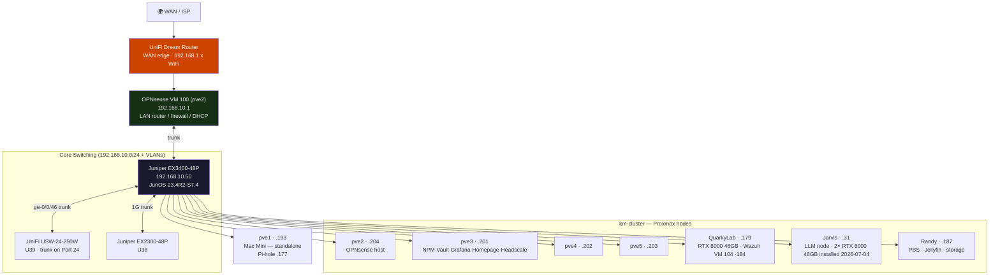

# NETFRAME — a research & education compute cluster

> **Kyle Mason** · USMC Veteran · EC-135/145 Instructor Pilot
> [`kylemason.org`](https://kylemason.org) · [`machismo0311`](https://github.com/machismo0311)

[](https://github.com/machismo0311/Home-Lab/actions/workflows/ci.yml)
[](https://github.com/machismo0311/Home-Lab/actions/workflows/netlab.yml)
[](https://github.com/machismo0311/Home-Lab/actions/workflows/diagram.yml)

NETFRAME (**km-cluster**) is a self-designed, self-operated **7-node Proxmox VE cluster** that does three real jobs at once: it provides dedicated GPU compute for **Deep Underground Neutrino Experiment (DUNE)** research, it runs a **multi-tenant AI/ML teaching cluster** used by university computer-science students, and it hosts a **self-hosted large-language-model inference platform** — all riding on enterprise-grade networking, storage, monitoring, and backups. It lives in a NetFRAME CS9000 42U rack and is documented here as a working technical portfolio.

---

## 🎯 What it powers

### 🔬 DUNE neutrino-physics research
**QuarkyLab** — a 44-core Dell R730 with **512 GB RAM** and an **NVIDIA RTX 8000 (48 GB)** — is a dedicated research node for the **Deep Underground Neutrino Experiment (DUNE)**. It runs a physicist's production ML workload and hosts a retrieval-augmented **"DUNE Agent"**: a RAG pipeline over the experiment's `dunereco` reconstruction codebase (Ollama + a Qdrant vector store) built to help new scientists navigate that codebase during onboarding. Off-site researchers reach the node over a **Cloudflare Tunnel** (no inbound ports, server IP hidden) with full GPU access.

### 🎓 A multi-tenant AI/ML teaching cluster
The same RTX 8000 is shared with **~15 university computer-science students per semester** learning AI/ML on real GPU hardware — without ever threatening the research workload. A **SLURM** scheduler with `gres/shard` + per-job **NVIDIA MPS** enforces a hard ~6 GB VRAM cap per job and up to **8 concurrent GPU jobs**; every job is isolated in a network-less **Apptainer** container (own home, read-only shared data, RAM-bounded); and research always wins — a researcher job **preempts and requeues** student jobs to reclaim the whole card, then they auto-restart. Students onboard with key-only SSH and a published lab guide. *(Multi-tenant GPU sharing validated end-to-end 2026-07-02.)*

### 🤖 A self-hosted LLM inference platform
**Jarvis** — an R730 with **384 GB RAM** and **2× RTX 6000 (48 GB VRAM total)** — serves **Qwen2.5-72B** via Ollama behind a custom **OpenAI-compatible router** (`llm_router`) with **RAG over this repository's documentation**, a ChatGPT-style web UI (Open WebUI), and a Discord **on-call bot** that can troubleshoot any cluster node through read-only SSH diagnostics and LLM tool-calling.

---

## 📊 At a glance

- **7-node Proxmox VE 9.2.3 cluster** · ~140 CPU cores · ~1.4 TB aggregate RAM
- **3 GPUs / 104 GB VRAM** — RTX 8000 48 GB + 2× RTX 6000 (48 GB) + RX 580 8 GB
- **~95 TB raw ZFS storage** across the fleet · ~50 drives under health monitoring
- **On-prem 72-billion-parameter LLM** + RAG over the full documentation base
- **Multi-tenant GPU** — 20 student + 6 researcher seats, hard per-tenant VRAM caps + preemption
- **Production ops** — HA DNS, tested PBS backups, Grafana→Discord alerting, Wazuh SIEM on all nodes, RKE2 Kubernetes, self-hosted Headscale VPN, Juniper EX3400 + 7-VLAN segmentation, 10 GbE fabric, CI/CD

> **Network as code:** [`netlab/`](netlab/) boots a virtual FRR/OSPF network and **tests real reachability in CI** on every push; [`topology/`](topology/) **generates the network diagram from a source-of-truth inventory** — CI fails the build if the picture drifts from the truth.

---

## Why this exists

I'm a U.S. Marine Corps aviator (EC-135/145 Instructor Pilot, FOQA Officer) transitioning into network & infrastructure engineering, currently pursuing my **CCNA**. NETFRAME is where I apply the discipline of mission-critical aviation — checklists, root-cause analysis, and zero-defect execution — to infrastructure that real people depend on:

- **FOQA flight-data analysis → observability:** metrics, dashboards, and anomaly detection (Prometheus / Grafana / Loki, Wazuh SIEM)
- **Instructor-pilot checklists → runbooks & change control:** every buildout and incident is written up as a repeatable procedure, with formal RCAs
- **Mission-critical systems → reliability engineering:** HA DNS, redundant firewalling, tested backups, tenant isolation, and blast-radius analysis

---

## Cluster Nodes

| Hostname | Role | IP | CPU | RAM | GPU | PVE | Kernel |
|---|---|---|---|---|---|---|---|
| **QuarkyLab** | DUNE research + student AI/ML (SLURM) | 192.168.10.179 | 2× E5-2699 v4 (44c/88t) | 512 GB | RTX 8000 48GB† | 9.2.3 | 6.14.11-9-pve† |
| **Jarvis** | LLM inference platform | 192.168.10.31 | 2× E5-2687W v4 | 384 GB | 2× RTX 6000 (48GB total)‡ | 9.2.3 | 6.14.11-9-pve‡ |
| **Randy** | Storage / PBS backup | 192.168.10.187 | 2× E5-2690 v3 (24c/48t) | 128 GB | RX 580 8GB | 9.1.1 | 7.0.12-1 |
| **pve2** | OPNsense host | 192.168.10.204 | i7-8700 | 32 GB | — | 9.2.3 | 7.0.12-1 |
| **pve3** | Core services / RKE2 CP | 192.168.10.201 | i7-8700 | 48 GB | — | 9.2.3 | 7.0.12-1 |
| **pve4** | Cluster node / RKE2 CP | 192.168.10.202 | i5-7500T | 32 GB | — | 9.2.3 | 7.0.12-1 |
| **pve5** | Cluster node / RKE2 CP | 192.168.10.203 | i5-7500T | 32 GB | — | 9.2.3 | 7.0.12-1 |

†QuarkyLab: RTX 8000 48GB installed & verified 2026-07-01 (nvidia-smi reports 48GB on NVIDIA 550.163.01; driver-free Turing swap). Kernel pinned — NVIDIA 550.163.01 requires 6.14.11-9-pve.  
‡Jarvis: **2× RTX 6000 installed & verified 2026-07-04** — 24GB each / 48GB total (driver 550.163.01, kernel 6.14.11-9-pve). Required a nouveau blacklist on first boot; fans managed by the `gpu-fan-control` daemon. Ollama GPU-backed, qwen2.5:72b pulled.

---

## Network

- **Juniper EX3400-48P** — enterprise fabric, JunOS 23.4R2-S7.4, IP `192.168.10.50`
- **UniFi Switch 24 PRO (PoE+)** — consumer fabric (IoT, VoIP, guest)
- **OPNsense 25.7** — VM 100 on pve2, handles routing/firewall/DHCP for all VLANs
- **10G fabric** — Mellanox ConnectX-3 DAC links from Randy/QuarkyLab/Jarvis to EX3400 xe- ports

### Topology



### VLANs

| ID | Name | Subnet |
|---|---|---|
| 1 | mgmt | 192.168.10.0/24 |
| 20 | trusted | 192.168.20.0/24 |
| 30 | servers | 192.168.30.0/24 |
| 40 | IoT | 192.168.40.0/24 |
| 50 | VoIP | 192.168.50.0/24 |
| 60 | guest | 192.168.60.0/24 |
| 70 | lab | 192.168.70.0/24 |

---

## Compute Tenancy (research + teaching on one GPU)

QuarkyLab's single RTX 8000 is safely shared between production research and a classroom:

- **SLURM** with `gres/shard` (8 shards) — up to **8 concurrent GPU jobs**.
- **Per-job NVIDIA MPS** with `CUDA_MPS_PINNED_DEVICE_MEM_LIMIT` — a hard **~6 GB VRAM cap** per student job (MIG isn't available on Turing, so this is the workaround).
- **Apptainer** containers per job — `--network=none`, private home + scratch, read-only shared data, RAM-bounded; `cgroup ConstrainDevices=yes` denies `/dev/nvidia*` to any job without a GPU grant. Students are batch-only (`sbatch`); uncontained interactive jobs are rejected.
- **Research priority** — the `research` partition (`PriorityTier=100`) **preempts + requeues** student jobs (`PreemptMode=REQUEUE`) so a researcher can claim the whole card on demand; students auto-restart after.
- **Fairness** — multifactor priority + fairshare so the queue favors students who've used the GPU least.
- **Access** — key-only SSH over a Cloudflare Tunnel (`quarkylab.kylemason.org`); no VPN, no inbound ports, server IP hidden. Onboarding is scripted per-roster with a hardened key-install helper and a published LaTeX student guide.

---

## Storage

### Randy — Internal (Proxmox Backup Server)

- **Boot:** RAID-1 mirror on 2× Seagate SAS SSDs via AVAGO 3108 MegaRAID
- **Data pool:** ZFS `datastore` — 4× RAIDZ2 vdevs: 3× 6-wide Toshiba AL15SEB18EQ 1.6TB 10K SAS + 1× 4-wide Seagate ST2000NX0423 1.8TB SATA (all in-pool, no spares)
- **Capacity:** 36.7TB raw / ~23TB usable | **PBS fingerprint:** `(stored in Vaultwarden — not published)`
- **PBS UI:** `https://192.168.10.187:8007`

### DS4246 — External JBOD

- 16× 4TB SAS, dual-path via LSI 9207-8e HBA (IT mode) + multipath, SFF-8644→SFF-8088 cables
- **Pool `bulk` — built & online 2026-07-08:** 2× 8-wide RAIDZ2, 58.2TB raw / ~41.3 TiB usable, reboot-verified (auto-imports cleanly)

---

## Services

| Service | Host | URL / Port | Notes |
|---|---|---|---|
| Proxmox Backup Server | Randy | `:8007` | v4.2.2, ZFS 36.7TB raw / ~23TB usable — daily backups 02:00/03:00 |
| OPNsense | pve2 (VM 100) | `192.168.10.1` | v25.7 |
| Pi-hole (primary) | pve1 (LXC, Mac Mini) | `192.168.10.177` | DNS filter — standalone node, NOT pve3 |
| Pi-hole (secondary) | pve5 (CT 108) | `192.168.10.178` | DNS HA — mirror of .177 via nebula-sync; OPNsense DHCP hands out both (2026-07-10) |
| Headscale | pve3 (LXC 105) | `192.168.10.186` | v0.29.1, self-hosted VPN |
| Wazuh | QuarkyLab (VM 104) | `https://192.168.10.184` | SIEM |
| step-ca | pve2 | `https://192.168.10.204:443` | Internal CA, `*.netframe.local` TLS |
| Vaultwarden | pve3 (LXC 102) | `http://192.168.10.182` | Active ✅ (healthy, onboot=1) |
| Open WebUI | pve3 (LXC 107) | `http://chat.netframe.local` | ChatGPT-style UI → llm_router; models `local`/`rag` |
| Jellyfin | Randy | `:8096` | v10.11.11; media on `/datastore/media` |
| Ollama + Qwen2.5 72B | Jarvis | `llm.netframe.local` | v0.31.1, GPU-backed on 2× RTX 6000 (installed 2026-07-04); qwen2.5:72b tensor-split across both |

> Selected services — full container/service inventory (NPM, Grafana/Prometheus/Loki, Homepage, Scrutiny, llm_router, …) is in the vault.

---

## LLM Infrastructure

Jarvis runs **Ollama** serving **Qwen2.5 72B Q4_K_M** across **2× RTX 6000** (48GB VRAM total, 24GB each) — GPUs installed & verified 2026-07-04, qwen2.5:72b pulled (tensor-splits across both cards). Stack: kernel 6.14.11-9-pve, NVIDIA 550.163.01, models on the `tank/models` ZFS dataset (7.2TB pool, since 2026-07-08).

A **FastAPI `llm_router.py`** (OpenAI-compatible) implements hybrid routing:
- Default: local Ollama inference (Qwen2.5 72B)
- Escalation: Claude API (`claude-opus-4-8`) on an explicit `escalate` flag, a `model=claude-*` request, or local failure. (Ollama exposes no logprobs, so routing is by flag/model/failure — not confidence scoring.)
- Optional `model:"rag"` grounds answers on the NETFRAME vault with `[source]` citations.

The **[netframe-monitor](https://github.com/machismo0311/netframe-monitor)** companion repo uses this same local LLM to interpret cluster-health diagnostics and publish a web report.

---

## Power

| UPS | Feeds | Capacity |
|---|---|---|
| Middle Atlantic UPS-OL2200R | R730s, Randy, DS4246 | 6× 12V 9Ah AGM series (76.4V) |
| Tripp Lite SMART1500VA | EX3400, UniFi, small compute | 1500VA |

PDU: APC AP7901 on EX3400 ge-0/0/38.

---

## Planned / In Progress

- [x] Randy commissioned — PBS live, ZFS datastore 36.7TB raw / ~23TB usable
- [x] Cluster upgrade — all cluster nodes to PVE 9.2.3 / kernel 7.0.12-1 (2026-06-22); Randy kernel/ZFS-only, stays on pve-manager 9.1.1
- [x] QuarkyLab RTX 8000 48GB swap ✅ 2026-07-01 (nvidia-smi reports 48GB, NVIDIA 550.163.01)
- [x] Jarvis 2× RTX 6000 install ✅ 2026-07-04 (24GB each / 48GB total; Ollama GPU-backed, qwen2.5:72b)
- [x] Multi-tenant SLURM + Apptainer + MPS GPU sharing on QuarkyLab ✅ validated 2026-07-02 (research preemption + per-job VRAM caps)
- [x] Backup schedules configured — daily to randy-pbs, 7d+4w retention
- [x] Wazuh SIEM + Promtail→Loki on all 8 nodes ✅ 2026-06-25
- [x] DS4246 → Randy — pool `bulk` built & online 2026-07-08 (2× 8-wide RAIDZ2, ~41.3 TiB usable, reboot-verified)
- [x] VLAN activation ✅ 2026-06-25 — EX3400 ge-0/0/46 trunk live, verified end-to-end. Fix: native-vlan-id at interface level (ELS)
- [x] Scrutiny — drive health UI live (~50 drives, collectors on Randy + QuarkyLab, 6h) ✅
- [x] RKE2 Kubernetes ✅ Phases 1-7 (2026-07-10/11) — HA control plane (VMs 201-203, VIP .54), Cilium, MetalLB (.71-.75), Randy NFS StorageClass + bare-metal storage worker, private registry (step-ca TLS + auto-renew). **NVIDIA GPU Operator deferred** (SLURM/Ollama own the cards). See `vault/Runbook/RKE2-Phase1-HA-ControlPlane-2026-07-10.md`
- [x] Headscale Phase 1 — pve3/4/5/Jarvis migrated to self-hosted (2026-06-22)
- [ ] Large-scale DUNE dataset landing + offsite restic→B2 backup tier (parked pending data)
- [ ] Headscale Phase 2 — QuarkyLab + a DUNE researcher's Mac (must migrate together)
- [ ] FreePBX + 5× Cisco CP-8841 VoIP phones
- [ ] Cyberpunk monitoring dashboard — live API integration

---

## Repo Structure

```
Home-Lab/
├── README.md
├── CLAUDE.md                     # Cluster context for Claude Code (canonical)
├── index.html                    # Personal landing page (kylemason.org)
├── docs/                         # Runbooks, incident reports, LaTeX sources (.tex)
├── runbooks/                     # Session runbooks (EX3400, VLAN, Homepage)
├── vault/                        # Obsidian knowledge base — canonical runbooks & topic docs
│   └── Compute/ Infrastructure/ Networking/ Runbook/ Projects/
├── scripts/                      # llm_router (FastAPI), jarvis-oncall bot, SLURM, gpu-fan-control
├── services/                     # homepage/ + netframe-monitor/ configs & systemd units
├── netlab/                       # containerlab virtual network (FRR/OSPF) + CI reachability tests
├── topology/                     # Network topology reference + diagram-as-code (inventory → Mermaid)
├── student-guide/                # QuarkyLab student & researcher onboarding guides
├── headscale/                    # Headscale VPN docs
└── dotfiles/                     # .bashrc, .bash_aliases
```

---

*NETFRAME · Kyle Mason · Greater Cleveland, OH · A research & education compute cluster, built and operated with aviation discipline.*
