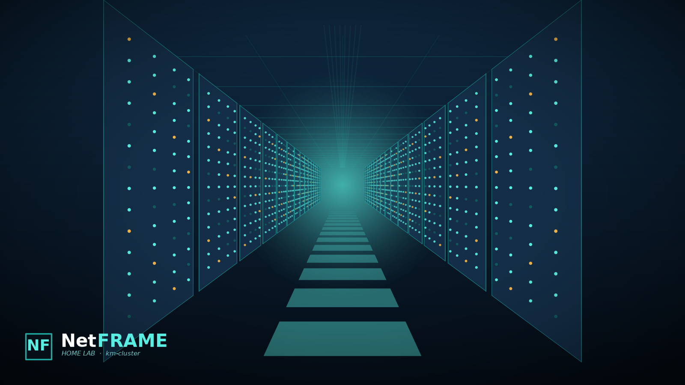
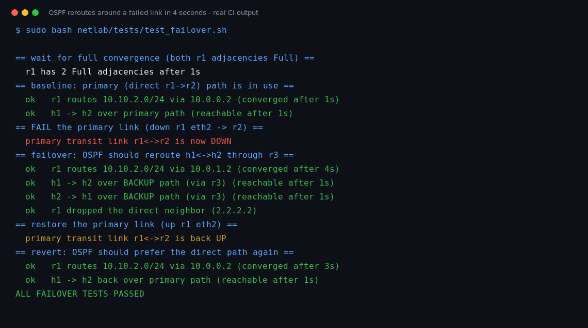
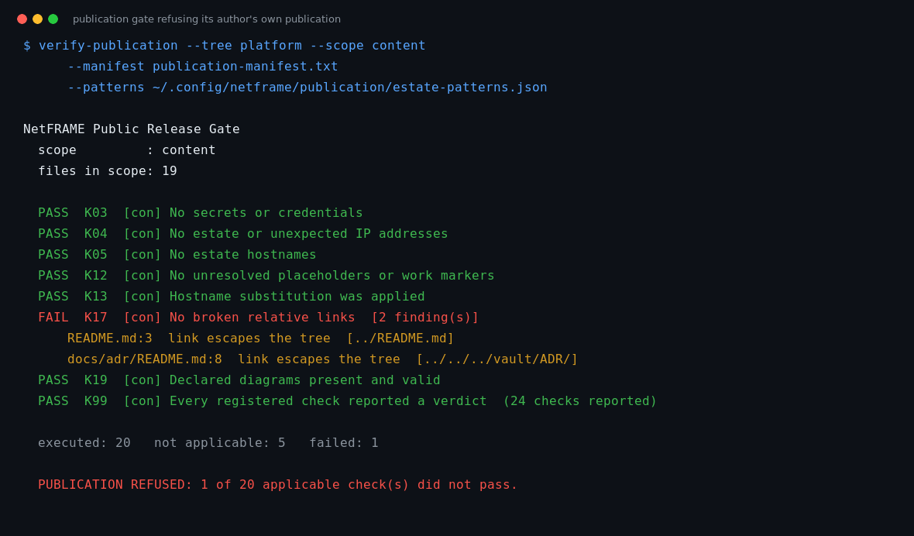

# NetFRAME

> **Kyle Mason** · USMC Infantry Veteran · EMS Helicopter Instructor Pilot
> [`kylemason.org`](https://kylemason.org) · [`machismo0311`](https://github.com/machismo0311)

**A production platform, operated like one.** Seven nodes carrying three real workloads with real
users, and the engineering discipline to run them safely: infrastructure as code, tested recovery,
continuous observability, and a virtual network that proves its own reachability on every commit.

Built and operated by one engineer, documented as if a team had to inherit it tomorrow.

|  |  |
|---|---|
| **Runs** | GPU compute for **DUNE** neutrino-physics research, a multi-tenant **AI/ML teaching cluster** for university students, and self-hosted **72B-parameter LLM inference** |
| **Proves** | A virtual network boots in CI and **asserts real reachability** on every push; the topology diagram is **generated from a source-of-truth inventory** and the build fails when the picture drifts from reality |
| **Governs** | Every estate change carries a stated rollback in an append-only change log; every incident becomes a formal RCA; assessments are tracked to closure with explicit lifecycle status |
| **Operates** | 7-node Proxmox cluster, VLAN-segmented Juniper and OPNsense networking, RKE2 Kubernetes, Ansible, Prometheus/Grafana/Loki, Wazuh SIEM, tested Proxmox Backup Server recovery |

## Start here

| | |
|---|---|
| **[Platform engineering](platform/)** | The engineering record: architecture, capabilities, and release process |
| **[Architecture decision records](platform/docs/adr/)** | Six decisions, each with the alternatives it rejected |
| **[Engineering stories](platform/docs/engineering-stories.md)** | Six things that went wrong. Four are defects I found in my own work |
| **[Governance](platform/docs/governance.md)** | Rules registered with the executable witness that enforces them |
| **[Release gate](release-gate/)** | A fail-closed publication verifier: 24 checks, proven by a 36-mutation campaign |
| **[Assessments](#security--reliability-engineering)** | Security and reliability, assessed against this estate and published in redacted form |
| **[Working code](https://github.com/machismo0311/netframe-monitor)** | netframe-monitor: a deterministic policy engine, an evidence engine, and an LLM confined to wording |
| **[Hardware](docs/infrastructure.md)** | The infrastructure reference and the [delivery record](docs/roadmap.md) |

## Evidence

**The network reroutes around a failed link in four seconds.** [`netlab/`](netlab/) boots three
FRR routers in CI on every push, then fails the primary link mid-test to prove OSPF reconverges
over the backup path and reverts when the link returns. This is the verbatim output of
[that run](https://github.com/machismo0311/Home-Lab/actions/runs/30949807889), not a diagram of
a network:

**The publication gate refused its own author.** Its first production run, on real content,
for a correct reason. The migration stopped before anything was committed:

- **[The gate](release-gate/)** — 24 checks plus a meta-check that fails the run if any
  registered check did not report, proven by a
  [36-mutation campaign](release-gate/scripts/publication_mutations.py) in which every seeded
  defect must be caught by its *expected* check.
- **[The diagram fails the build](topology/)** — generated from
  [`inventory.yml`](topology/inventory.yml). Both the committed diagram and the one rendered in
  [the infrastructure reference](docs/infrastructure.md) are generated, and CI fails when either
  drifts from the inventory.

## Engineering decisions

The problems worth reading about are the ones with a constraint attached.

**Sharing one GPU between production research and a classroom.** A single RTX 8000 serves a
physicist's production workload and roughly fifteen students at once. MIG is unavailable on Turing,
so per-job NVIDIA MPS enforces a hard VRAM cap instead; every job runs network-less in an Apptainer
container with a private home and read-only shared data; and the research partition **preempts and
requeues** student work so a researcher can reclaim the whole card on demand, with student jobs
auto-restarting afterwards. Research never waits, and no student job can starve another.
Details in [compute tenancy](#compute-tenancy-research--teaching-on-one-gpu).

**Making the documentation fail the build.** A topology diagram that drifts from reality is worse
than no diagram, because it is trusted. The diagram is therefore generated from an inventory file
and CI fails when the two disagree, which converts documentation accuracy from a habit into a gate.

**Proving the network, not describing it.** Network changes are easy to describe and hard to
verify, so a containerlab topology running FRR and OSPF boots in CI and asserts genuine end-to-end
reachability on every push. A routing claim that no longer holds breaks the build.

**Treating the estate as something to assess, not just to build.** The platform is subjected to
its own security and reliability assessments, published in redacted form, with findings carried
to closure under explicit lifecycle states rather than published once and abandoned.

## 🎯 What it powers

### 🔬 DUNE neutrino-physics research
**QuarkyLab** - a 44-core Dell R730 with **512 GB RAM** and an **NVIDIA RTX 8000 (48 GB)** - is a dedicated research node for the **Deep Underground Neutrino Experiment (DUNE)**. It runs a physicist's production ML workload and hosts a retrieval-augmented **"DUNE Agent"**: a RAG pipeline over the experiment's `dunereco` reconstruction codebase (Ollama + a Qdrant vector store) built to help new scientists navigate that codebase during onboarding. Off-site researchers reach the node over a **Cloudflare Tunnel** (no inbound ports, server IP hidden) with full GPU access.

### 🎓 A multi-tenant AI/ML teaching cluster
The same RTX 8000 is shared with **~15 university computer-science students per semester** learning AI/ML on real GPU hardware, without ever threatening the research workload. Students onboard with key-only SSH and a published lab guide. *(Multi-tenant GPU sharing validated end-to-end 2026-07-02.)* The scheduling, isolation and preemption mechanics are in [compute tenancy](#compute-tenancy-research--teaching-on-one-gpu).

### 🤖 A self-hosted LLM inference platform
**Jarvis** - an R730 with **384 GB RAM** and **2× RTX 6000 (48 GB VRAM total)** - serves **Qwen2.5-72B** via Ollama behind a custom **OpenAI-compatible router** (`llm_router`) with **RAG over this repository's documentation**, a ChatGPT-style web UI (Open WebUI), and a Discord **on-call bot** that can troubleshoot any cluster node through read-only SSH diagnostics and LLM tool-calling.

---

## 📊 At a glance

- **7-node Proxmox VE 9.2.3 cluster** · ~140 CPU cores · ~1.4 TB aggregate RAM
- **3 GPU cards / 96 GB VRAM** - RTX 8000 48 GB (QuarkyLab) + 2× RTX 6000 (48 GB, Jarvis); RX 580 planned for Randy transcode
- **~127 TB raw ZFS storage** across the fleet · ~56 drives under health monitoring
- **On-prem 72-billion-parameter LLM** + RAG over the full documentation base
- **Multi-tenant GPU** - 20 student + 6 researcher seats, hard per-tenant VRAM caps + preemption
- **Production ops** - HA DNS, tested PBS backups, Grafana→Discord alerting, Wazuh SIEM on all nodes, RKE2 Kubernetes, self-hosted Headscale VPN, Juniper EX3400 + 7-VLAN segmentation, 10 GbE fabric, CI/CD

> **Network as code:** [`netlab/`](netlab/) boots a virtual FRR/OSPF network and **tests real reachability in CI** on every push; [`topology/`](topology/) **generates the network diagram from a source-of-truth inventory** - CI fails the build if the picture drifts from the truth.

---

## Why this exists

I'm a U.S. Marine Corps infantry veteran and, afterwards, an EMS helicopter instructor pilot (EC-135/145) and FOQA officer, now transitioning into network & infrastructure engineering, currently pursuing my **CCNA**. NETFRAME is where I apply the discipline of mission-critical aviation - checklists, root-cause analysis, and zero-defect execution - to infrastructure that real people depend on:

- **FOQA flight-data analysis → observability:** metrics, dashboards, and anomaly detection (Prometheus / Grafana / Loki, Wazuh SIEM)
- **Instructor-pilot checklists → runbooks & change control:** every buildout and incident is written up as a repeatable procedure, with formal RCAs
- **Mission-critical systems → reliability engineering:** HA DNS, redundant firewalling, tested backups, tenant isolation, and blast-radius analysis

---

## 🔒 Security & Reliability Engineering

NETFRAME is treated as a system to be *assessed and operated*, not just stood up. Redacted, public editions of that work:

- **[Security assessment](https://github.com/machismo0311/netframe-security-assessment-public)** - an authorized, defensive assessment: rules of engagement, evidence-driven findings ranked by severity, attack-chain analysis, confirmed positive controls, and a prioritized remediation roadmap.
- **[SRE reliability assessment](https://github.com/machismo0311/netframe-reliability-assessment-public)** - availability posture from live telemetry, a 12-mode FMEA, MTTR/MTBF reasoning, a 3-2-1 backup gap analysis, an RTO/RPO disaster-recovery plan, and a four-horizon reliability roadmap.
- **[Operations documentation sample](https://github.com/machismo0311/netframe-ops-docs-public)** - a redacted bare-metal build guide (phased rebuild with validation gates) and a disaster-recovery plan (RTO/RPO per service tier).
- **[AI-Ops trustworthiness case study](docs/aiops-trustworthiness-case-study-2026-07-15.md)** - making an LLM-assisted operations assistant *trustworthy*, not just capable: one deterministic policy engine (allowed?), one evidence engine (how well-supported, how sure?), and one audit trail, with the model reduced to wording. Covers the failure classes found, the guardrails installed, and the tooling catching its own regressions before they shipped.

Every change to the estate is recorded in an **append-only change log with a stated rollback**, and incidents are written up as formal **RCAs and after-action reports**. Full unredacted editions, a Fortune-100 operational benchmark, and a 30+ document operations library are kept private.

**Publishing discipline (OPSEC).** What is *not* published is treated as a control in its own right. Internal addressing and topology are published deliberately (see [SECURITY.md](SECURITY.md)); live credentials, keys, MAC addresses, and hardware serials are not. The public editions linked above are generated from private masters through a scripted sanitization pass that generalizes hosts to roles (`NODE-N`, `STORAGE`, `GPU-A`) and strips identifiers, and the public security report is built behind a compile-time gate so a value left in the source cannot reach the published PDF. This repository runs a **pre-commit secret and recon scanner** over staged changes (see [`.githooks/`](.githooks/)), and published documents are checked for leaked identifiers before release. Deciding what to withhold is part of the engineering, not an afterthought.

---

---

## Compute Tenancy (research + teaching on one GPU)

QuarkyLab's single RTX 8000 is safely shared between production research and a classroom:

- **SLURM** with `gres/shard` (8 shards) - up to **8 concurrent GPU jobs**.
- **Per-job NVIDIA MPS** with `CUDA_MPS_PINNED_DEVICE_MEM_LIMIT` - a hard **~6 GB VRAM cap** per student job (MIG isn't available on Turing, so this is the workaround).
- **Apptainer** containers per job - `--network=none`, private home + scratch, read-only shared data, RAM-bounded; `cgroup ConstrainDevices=yes` denies `/dev/nvidia*` to any job without a GPU grant. Students are batch-only (`sbatch`); uncontained interactive jobs are rejected.
- **Research priority** - the `research` partition (`PriorityTier=100`) **preempts + requeues** student jobs (`PreemptMode=REQUEUE`) so a researcher can claim the whole card on demand; students auto-restart after.
- **Fairness** - multifactor priority + fairshare so the queue favors students who've used the GPU least.
- **Access** - key-only SSH over a Cloudflare Tunnel (`quarkylab.kylemason.org`); no VPN, no inbound ports, server IP hidden. Onboarding is scripted per-roster with a hardened key-install helper and a published LaTeX student guide.

---

## Infrastructure

The full hardware, network, storage, and service inventory now lives in the
[infrastructure reference](docs/infrastructure.md), and the delivery record in the
[roadmap](docs/roadmap.md). Nothing was removed; the top-level page simply leads with
engineering rather than with a parts list.

---

*NetFRAME · Kyle Mason · Greater Cleveland, OH · A production platform built and operated with aviation discipline.*
