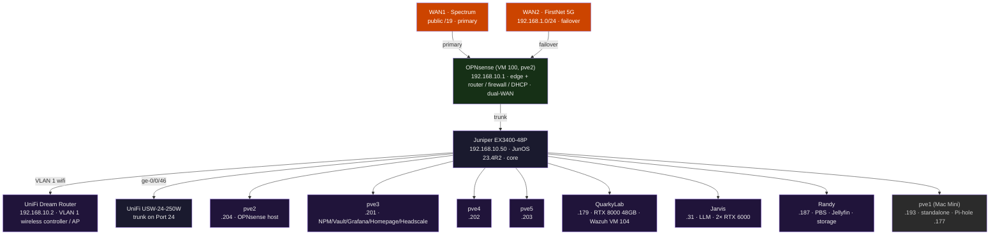

# NetFRAME Infrastructure Reference

Full hardware, network, storage, and service inventory for the NetFRAME platform.
Moved out of the README so the top-level page leads with engineering rather than parts.
Nothing here has been changed; this is the previous README content verbatim.

Back to the [platform overview](../README.md).

---

## Cluster Nodes

| Hostname | Role | IP | CPU | RAM | GPU | PVE | Kernel |
|---|---|---|---|---|---|---|---|
| **QuarkyLab** | DUNE research + student AI/ML (SLURM) | 192.168.10.179 | 2× E5-2699 v4 (44c/88t) | 512 GB | RTX 8000 48GB† | 9.2.3 | 6.14.11-9-pve† |
| **Jarvis** | LLM inference platform | 192.168.10.31 | 2× E5-2687W v4 | 384 GB | 2× RTX 6000 (48GB total)‡ | 9.2.3 | 6.14.11-9-pve‡ |
| **Randy** | Storage / PBS backup | 192.168.10.187 | 2× E5-2690 v3 (24c/48t) | 128 GB | RX 580 8GB (planned)◊ | 9.1.1 | 7.0.12-1 |
| **pve2** | OPNsense host | 192.168.10.204 | i7-8700 | 32 GB | - | 9.2.3 | 7.0.12-1 |
| **pve3** | Core services / RKE2 CP | 192.168.10.201 | i7-8700 | 48 GB | - | 9.2.3 | 7.0.12-1 |
| **pve4** | Cluster node / RKE2 CP | 192.168.10.202 | i5-7500T | 32 GB | - | 9.2.3 | 7.0.12-1 |
| **pve5** | Cluster node / RKE2 CP | 192.168.10.203 | i5-7500T | 32 GB | - | 9.2.3 | 7.0.12-1 |

†QuarkyLab: RTX 8000 48GB installed & verified 2026-07-01 (nvidia-smi reports 48GB on NVIDIA 550.163.01; driver-free Turing swap). Kernel pinned - NVIDIA 550.163.01 requires 6.14.11-9-pve.  
‡Jarvis: **2× RTX 6000 installed & verified 2026-07-04** - 24GB each / 48GB total (driver 550.163.01, kernel 6.14.11-9-pve). Required a nouveau blacklist on first boot; fans managed by the `gpu-fan-control` daemon. Ollama GPU-backed, qwen2.5:72b pulled.  
◊Randy: RX 580 8GB is seated but **not yet powered** (pending a PCIe aux power cable), so the OS does not enumerate it - Jellyfin transcoding is currently CPU-only. Intended for display/transcode (ROCm), not compute.

---

## Network

- **Juniper EX3400-48P** - enterprise fabric, JunOS 23.4R2-S7.4, IP `192.168.10.50`
- **UniFi Switch 24 PRO (PoE+)** - consumer fabric (IoT, VoIP, guest)
- **OPNsense 25.1.12** - VM 100 on pve2, handles routing/firewall/DHCP for all VLANs
- **10G fabric** - Mellanox ConnectX-3 DAC links from Randy/QuarkyLab/Jarvis to EX3400 xe- ports

### Topology

<!-- BEGIN GENERATED TOPOLOGY -- edit topology/inventory.yml, not this block -->

<!-- END GENERATED TOPOLOGY -->

### VLANs

| ID | Name | Subnet |
|---|---|---|
| 1 | mgmt | 192.168.10.0/24 |
| 20 | trusted | 192.168.20.0/24 |
| 30 | servers | 192.168.30.0/24 |
| 40 | IoT | 192.168.40.0/24 |
| 50 | VoIP | 192.168.50.0/24 |
| 60 | guest | 192.168.60.0/24 |
| 70 | lab | 192.168.70.0/24 |

---

## Storage

### Randy - Internal (Proxmox Backup Server)

- **Boot:** RAID-1 mirror on 2× Seagate SAS SSDs via AVAGO 3108 MegaRAID
- **Data pool:** ZFS `datastore` - 4× RAIDZ2 vdevs: 3× 6-wide Toshiba AL15SEB18EQ 1.6TB 10K SAS + 1× 4-wide Seagate ST2000NX0423 1.8TB SATA (all in-pool, no spares)
- **Capacity:** 36.7TB raw / ~23TB usable | **PBS fingerprint:** `(stored in Vaultwarden - not published)`
- **PBS UI:** `https://192.168.10.187:8007`

### DS4246 - External JBOD

- 22× 4TB SAS, dual-path via LSI 9207-8e HBA (IT mode) + multipath, SFF-8644→SFF-8088 cables (2 bays free)
- **Pool `bulk` - built 2026-07-08, expanded 2026-07-17:** 3× RAIDZ2 vdevs (8+8+6-wide), 80.0TB raw / ~55 TiB usable, reboot-verified (auto-imports cleanly)

### QuarkyLab - Local ZFS workspace pool

- **Controller:** Dell PERC H330 Mini (LSI SAS-3 3008), RAID-Mode + JBOD ON - drives pass through for ZFS; 8-bay BP13G+ backplane
- **Pool `workspace`:** 6-wide RAIDZ1 (5× 2TB SATA + 1× 2TB SAS) - **10.9TB raw / ~9.1TB usable**, lz4, `/workspace` - student/researcher homes + system containerd store
- **Hot spare:** 1× 2TB SAS (auto-resilvers on a member failure)
- **Boot/OS:** separate 2TB disk (Proxmox `pve` LVM + Wazuh VM 104); expanded 5→6 wide via RAIDZ expansion on 2026-07-13

---

## Services

| Service | Host | URL / Port | Notes |
|---|---|---|---|
| Proxmox Backup Server | Randy | `:8007` | v4.2.2, ZFS 36.7TB raw / ~23TB usable - daily backups 02:00/03:00 |
| OPNsense | pve2 (VM 100) | `192.168.10.1` | v25.1.12 |
| Pi-hole (primary) | pve1 (LXC, Mac Mini) | `192.168.10.177` | DNS filter - standalone node, NOT pve3 |
| Pi-hole (secondary) | pve5 (CT 108) | `192.168.10.178` | DNS HA - mirror of .177 via nebula-sync; OPNsense DHCP hands out both (2026-07-10) |
| Headscale | pve5 (LXC 105) | `192.168.10.186` | v0.29.1, self-hosted VPN |
| Wazuh | QuarkyLab (VM 104) | `https://192.168.10.184` | SIEM |
| step-ca | pve2 | `https://192.168.10.204:443` | Internal CA, `*.netframe.local` TLS |
| Vaultwarden | pve3 (LXC 102) | `http://192.168.10.182` | Active ✅ (healthy, onboot=1) |
| Open WebUI | pve3 (LXC 107) | `http://chat.netframe.local` | ChatGPT-style UI → llm_router; models `local`/`rag` |
| Jellyfin | Randy | `:8096` | v10.11.11; media on `/datastore/media` |
| Ollama + Qwen2.5 72B | Jarvis | `llm.netframe.local` | v0.31.1, GPU-backed on 2× RTX 6000 (installed 2026-07-04); qwen2.5:72b tensor-split across both |

> Selected services - full container/service inventory (NPM, Grafana/Prometheus/Loki, Homepage, Scrutiny, llm_router, …) is in the vault.

---

## LLM Infrastructure

Jarvis runs **Ollama** serving **Qwen2.5 72B Q4_K_M** across **2× RTX 6000** (48GB VRAM total, 24GB each) - GPUs installed & verified 2026-07-04, qwen2.5:72b pulled (tensor-splits across both cards). Stack: kernel 6.14.11-9-pve, NVIDIA 550.163.01, models on the `tank/models` ZFS dataset (7.2TB pool, since 2026-07-08).

A **FastAPI `llm_router.py`** (OpenAI-compatible) implements hybrid routing:
- Default: local Ollama inference (Qwen2.5 72B)
- Escalation: Claude API (`claude-opus-4-8`) on an explicit `escalate` flag, a `model=claude-*` request, or local failure. (Ollama exposes no logprobs, so routing is by flag/model/failure - not confidence scoring.)
- Optional `model:"rag"` grounds answers on the NETFRAME vault with `[source]` citations.

The **[netframe-monitor](https://github.com/machismo0311/netframe-monitor)** companion repo uses this same local LLM to interpret cluster-health diagnostics and publish a web report.

---

## Power

| UPS | Feeds | Capacity |
|---|---|---|
| Middle Atlantic UPS-OL2200R | R730s, Randy, DS4246 | 6× 12V 9Ah AGM series (76.4V) |
| Tripp Lite SMART1500VA | EX3400, UniFi, small compute | 1500VA |

PDU: APC AP7901 on EX3400 ge-0/0/38.

---
## Repo Structure

```
Home-Lab/
├── README.md
├── CLAUDE.md                     # Cluster context for Claude Code (canonical)
├── index.html                    # Personal landing page (kylemason.org)
├── homelab-setup.md              # Bare-metal build notes
├── docs/                         # Runbooks, incident reports, LaTeX sources (.tex)
├── runbooks/                     # Session runbooks (EX3400, VLAN, Homepage)
├── vault/                        # Obsidian knowledge base - canonical runbooks & topic docs
│   └── Compute/ Infrastructure/ Networking/ Runbook/ Projects/
├── scripts/                      # llm_router (FastAPI), jarvis-oncall bot, SLURM, gpu-fan-control
├── playbooks/                    # Ansible: backup-verify, hardening desired-state + cron wrappers
├── .githooks/                    # pre-commit (secret scanning) + installer
├── netlab/                       # containerlab virtual network (FRR/OSPF) + CI reachability tests
├── topology/                     # Network topology reference + diagram-as-code (inventory → Mermaid)
├── student-guide/                # QuarkyLab student & researcher onboarding guides
├── headscale/                    # Headscale VPN docs
└── dotfiles/                     # .bashrc, .bash_aliases
```

