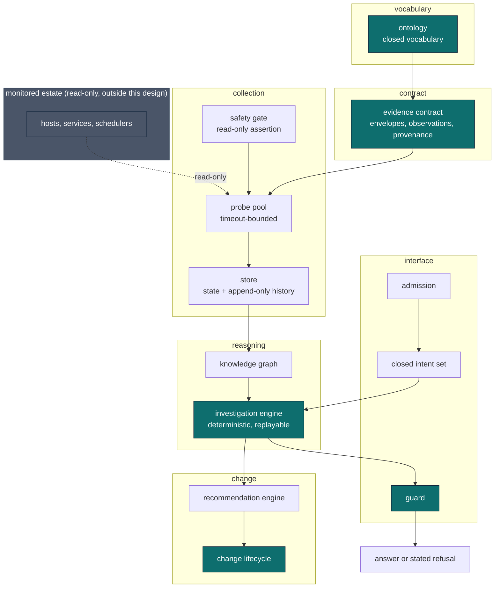
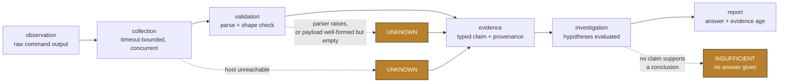
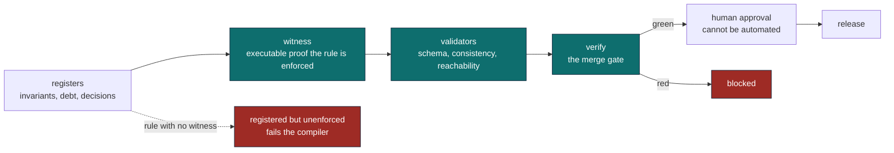
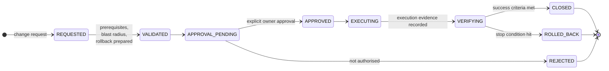

<!--
  Public edition.
  Source material reused: the layered-architecture and collection-sequence diagrams in
  docs/01-architecture/INVESTIGATION-ENGINE-ARCHITECTURE.md and
  docs/95-review-board/OIE-DESIGN-2026-07-29.md, whose Mermaid blocks were already
  estate-independent; plus the decisions recorded in ADR-021, ADR-024, ADR-025,
  ADR-026, ADR-027, ADR-029, ADR-030 and ADR-031.
  Sanitization: internal review-board identifiers (NF-DM-nnn) and module status
  annotations removed, because they reference records that are not published and would
  read as dangling. No estate identifier appeared in the source diagrams.
-->

# Architecture

Four diagrams. Each is here to explain a decision, not to depict a system, so each is paired with
the constraint that produced it.

Everything below is estate-independent by construction: the monitored estate appears as a single
boundary because nothing inside it is part of this design.

## 1. System architecture

The platform is layered so that each layer can only depend downward. Vocabulary does not know about
evidence, evidence does not know about investigations, and no layer reaches back up.

**Ownership boundaries.** Exactly one component may define each thing. The ontology owns the
vocabulary, so no module invents a term locally. Admission is owned by the kernel rather than by a
transport, because a second transport would otherwise reimplement the rules slightly differently
and nobody would notice until it diverged. The guard owns the vocabulary of unsupported judgement,
so a component cannot describe a conclusion as supported using words the guard does not police.

**Data boundaries.** Estate access is read-only, asserted by a gate that runs before collection
rather than trusted as a convention. Evidence crosses layers only inside the evidence contract, and
nothing downstream may widen a claim it did not measure.

**Public package boundary.** Teal components are represented in the public edition through their
documentation and decision records. The estate boundary is deliberately opaque and always will be:
it is the one part of this system that is specific to one operator.

## 2. Evidence flow

The path from an observation to a report, and the two places where the honest answer is nothing.

**Where UNKNOWN is preserved rather than fabricated.** An unreachable host degrades to `UNKNOWN`,
never to a default. A parser that raises degrades to `UNKNOWN`. Critically, a **well-formed payload
containing nothing** also degrades to `UNKNOWN`, because "monitoring returned successfully and
found zero targets" is the exact shape of an outage reported as health.

Claim strength is the **weakest** class among supporting claims, never the strongest, so a single
confident measurement cannot launder the unknowns beside it. When nothing supports a conclusion the
result is `INSUFFICIENT` and no answer is produced.

## 3. Governance flow

How a written rule becomes something that fails a build.

**Where enforcement actually occurs.** Not in the register. A register records intent, and intent
that nothing checks decays silently. Enforcement is the **witness**: executable evidence that the
invariant is real, which is what separates "we wrote a rule" from "the rule fails the build".

A registered invariant with no witness is itself a failure, so the register cannot quietly
accumulate aspirations. Human approval sits after the gate and not inside it, because the machine
decides whether something is *safe and complete*, and only a person decides whether it *should*
happen.

## 4. Execution lifecycle

A change from proposal to closure, including the two things most lifecycles omit: where rollback is
prepared, and where evidence is produced.

**Rollback is prepared before approval, not after failure.** A change is not validated until its
rollback exists and has been verified, because a rollback authored during an incident is a plan
nobody has tested at the worst possible moment.

**Evidence is produced at execution and again at verification.** Closure requires the success
criteria to be met and recorded; there is no path from executing to closed that skips verification.
States cannot be skipped, and nothing closes on prose.

**The system emits a plan; a human executes it.** Higher-risk action classes have no handler to
call, so the boundary is structural rather than a policy check that could be misconfigured.

---

Next: [Engineering stories](engineering-stories.md), what went wrong and what changed. · [Package index](../README.md)
