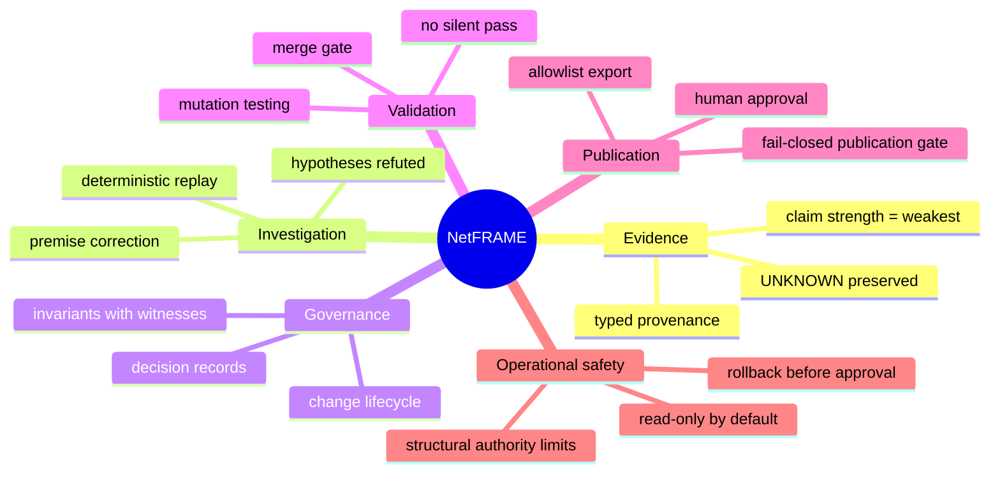

<!--
  Public edition. Authored for publication; no private source document existed.
  Assembled from the capability set in NF-PUBSTRATEGY-001 and the decisions recorded
  in the published ADRs.
  Sanitization: none required. Grouped by capability rather than by implementation, so
  no module layout or estate detail is exposed.
-->

# Capability map

What the platform provides, grouped by what it does rather than by how it is built. Each row names
the evidence a reader can check, so nothing here rests on assertion alone.

## The capabilities

| Capability | What it means | Evidence a reader can check |
|---|---|---|
| **Evidence engine** | Every claim carries how it was obtained: measured, inferred, assumed, or unknown. Claim strength is the weakest supporting claim, never the strongest | [Glossary](glossary.md), and the four mutations in [engineering stories](engineering-stories.md) that each try to remove the invariant and are each caught |
| **Investigation** | Answers a question from recorded evidence, evaluates competing hypotheses, and will contradict the premise of the question when the evidence does not support it | The decision record for this is held privately; the behaviour is described in [architecture.md](architecture.md) |
| **Deterministic replay** | The same recorded input produces byte-identical output on any machine, so a diagnosis is reviewable rather than merely believable | [ADR-030](adr/ADR-030-incident-memory.md) |
| **Governance** | Rules are registered with the executable witness that enforces them. A rule with no witness fails the build rather than sitting in a document | [governance.md](governance.md), [governance-compiler.md](governance-compiler.md) |
| **Validation** | Coverage is not evidence. Mutation testing seeds specific defects and requires the expected check to catch them; a surviving mutation is a located hole | [mutation-testing.md](mutation-testing.md) |
| **Publication gate** | Publication is verified rather than reviewed by eye: 24 checks, fail-closed, mutation-tested against itself, with human approval after the machine and not instead of it | The gate ships with its own campaign and unit suite |
| **Change management** | A twelve-state lifecycle where states cannot be skipped, rollback is prepared before approval, and nothing closes without verification | [release-process.md](release-process.md) |
| **Architecture discipline** | Decisions are recorded with their rejected alternatives and their falsification criteria, and dependency direction is enforced by a gate whose exceptions can only expire | [ADR index](adr/), particularly [ADR-035](adr/ADR-035-dependency-direction-gate.md) |
| **Documentation as a gate** | Documentation that drifts from reality fails a build. Accuracy is enforced rather than intended | [ADR-029](adr/ADR-029-history-freshness-gate.md) |
| **Operational safety** | Read-only by default. Higher-risk actions have no handler to call, so the limit is structural rather than a policy check that can be misconfigured | [architecture.md](architecture.md), execution lifecycle |

## What is deliberately absent

**Autonomous remediation.** The platform emits a plan; a person executes it. This is a design
position rather than an unfinished feature: an operator who cannot say what a system would have
done cannot supervise it.

**A single confidence score.** Confidence is reported as a provenance mix and an evidence age,
because collapsing those into one number discards exactly the information needed to judge it.

**Estate specifics.** Addressing, topology and host identity are not published. What is withheld is
treated as a control in its own right, not as an omission.

---

Next: [Architecture](architecture.md), how it is put together. · [Package index](../README.md)
