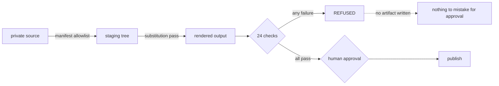
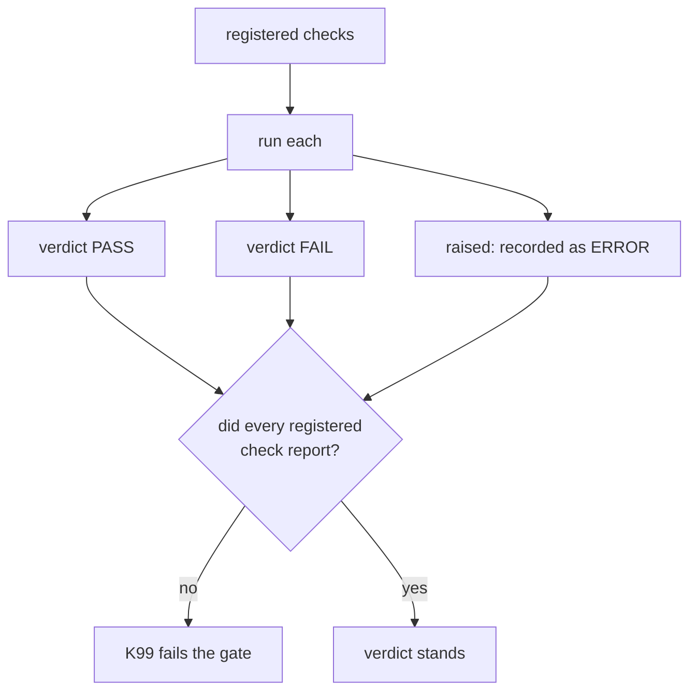

# Design

Why this tool is shaped the way it is, including the two things it got wrong first.

## The problem

Publication is a one-way door. A private address, a hostname, or a personal email that reaches a
public tree cannot be recalled: history retains it, forks copy it, and search engines index it.
Removal reduces discoverability and nothing more.

The usual control is review. Review finds the obvious and misses the boring: a fixture six
directories down, a path inside a code comment, an address in a test.

So the control has to be mechanical, and a mechanical control is only worth having if it fails
closed. A scanner that silently skips a check it could not run is worse than no scanner, because it
produces confidence without coverage.

## The three decisions

### 1. Allowlist first, denylist second

An export copies only files named in a manifest. Anything not named is refused, not skipped.

A denylist alone answers "does this contain something I know is bad." An allowlist answers "is this
something I decided to publish." Only the second question is safe by default, because the first
depends on the completeness of a list that can never be complete.

The denylist still runs, over the rendered output, because the allowlist says nothing about
*content*. An approved file can still contain an address.

### 2. Absence of a verdict is a failure

Every check is registered before it runs. After the run, the executor compares the set of checks
that reported against the set registered, and fails on any difference.

This is the K99 check, and it exists because the realistic failure is not a check returning the
wrong answer. It is a check that never ran: an exception swallowed, a filter that matched nothing,
a refactor that dropped a registration. All three produce a green result with a hole in it.

### 3. The tool must not carry the target list

A denylist gate contains the things it denies. That is unavoidable, and it means a gate written for
one estate is a description of that estate.

The resolution is to separate shape from literal. `\b(?:[0-9a-f]{2}:){5}[0-9a-f]{2}\b` is a MAC
address in general and discloses nothing. A list of six hostnames is a map. Shapes are compiled in;
literals load from a file the tool never publishes.

## What this got wrong first

**The mutation campaign was seeded with real values.** The reasoning was that a gate should be
tested against the actual threat, not a sanitised approximation, so the campaign used the real
public address, a real MAC, the owner's email, and real hostnames.

That reasoning is right about testing and wrong about publication. It made the test suite the
single largest disclosure in the package, and it was found by pointing the gate at its own source
tree, where it reported fifteen failing checks against itself.

The fix is the patterns file described above. The campaign now generates a fictional vocabulary in
code and still catches every mutation, which demonstrates that testing against real values was
never necessary: the mechanism is shape-matching, and a fictional value of the same shape exercises
it identically. The vocabulary is generated rather than committed, because a committed example is a
template for the real file.

**The first internal-reference rule matched any `word/word` token.** On a clean baseline it flagged
`docs/architecture.md`, an ordinary relative link, as a branch reference. A branch name and a
relative path are lexically identical, so a shape-based rule cannot separate them; the rule now
keys off git context instead.

That false positive was fixed rather than accepted. A gate's first false positive is the one that
teaches everybody that red is negotiable, and a rule people learn to ignore is worse than no rule.
Both the legitimate paths and the genuine references are now pinned by regression tests.

## What the checks cost

The gate is IO-bound and reads each text file once into memory. On a tree of a few hundred files it
completes in well under a second, which matters only because a control that is slow enough to skip
gets skipped.

Determinism is a property, not an aspiration: no clock, no randomness, no network, no environment
inspection. Two runs over the same tree produce identical output bytes, and K21 asserts it by
hashing the tree twice within a single run.
