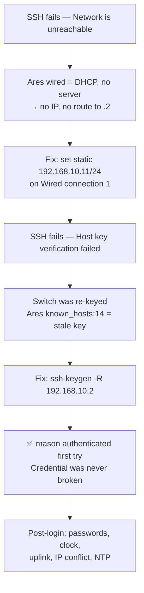

# Juniper EX3400 — SSH Authentication Failure: RESOLVED Post-Mortem

| Field | Value |
|---|---|
| **Device** | Juniper EX3400 (`KM-EX3400`) — purchased used, EX3400-48P |
| **OS** | JunOS 20.2R3.9 |
| **Original Symptom** | "SSH authentication always fails" — password prompt appeared, then rejected |
| **Console** | Functional throughout (root login) |
| **Status** | ✅ RESOLVED — 2026-06-05 |
| **Actual Root Cause** | Not authentication — network path failure + stale SSH host key |

---

## Executive Summary

The presenting symptom ("SSH authentication always fails") was **never an authentication problem.** The credential was correct throughout. Two separate issues were masquerading as auth failure:

1. **Ares had no IP on the management subnet** — its wired connection was set to DHCP with no DHCP server on the islanded segment → `Network is unreachable` before SSH could even connect.
2. **Stale SSH host key** — the switch had been re-keyed. Ares's `known_hosts:14` held an old ED25519 fingerprint → `Host key verification failed` before any password prompt was reached.

Once both were cleared, **`mason` authenticated on the first attempt with no credential changes.** The password had been correct all along.

Everything after that (uplink, IP conflict, NTP, DAC) was infrastructure work, not auth.

---

## What Happened — Actual Flow



---

## All Auth Hypotheses — ELIMINATED

Every authentication-related cause was ruled out. The credential stack was completely healthy.

| Hypothesis | Verdict | Evidence |
|---|---|---|
| Inherited `authentication-order` → RADIUS/TACACS+ | ❌ Eliminated | All three `show configuration system ...` commands returned empty |
| `mason` account / password | ❌ Eliminated | uid 2000, `super-user`, valid `$6$` SHA-512 hash — authenticated first try once network fixed |
| SSH service restricting password auth | ❌ Eliminated | `set system services ssh` bare — no `no-passwords`, no `authentication-key-only` |
| Login retry lockout | ❌ Eliminated | Not present |
| JunOS 20.2R3.9 auth defect | ❌ Eliminated | Credential worked once underlying issues cleared |
| Config / user-database corruption | ❌ Eliminated | Config healthy, factory-default-ish base |

Config snapshot confirming empty AAA:
```
show configuration system authentication-order   → (empty)
show configuration system radius-server          → (empty)
show configuration system tacplus-server         → (empty)
show configuration system login user mason       → uid 2000; class super-user; authentication { encrypted-password "$6$..."; }
show configuration system services ssh           → (bare — no restrictions)
```

---

## Actual Root Cause 1 — Ares Had No Route to the Switch

### Problem
Ares's wired profile (`Wired connection 1`, `enp0s31f6`) was configured for **DHCP/auto**. The EX3400 bench segment had no DHCP server, so the interface never acquired an IP. With no IP, the kernel had no route to `192.168.10.0/24`:

```
ssh: connect to host 192.168.10.2 port 22: Network is unreachable
```

This was not an auth failure — SSH never reached the switch at all.

### Diagnosis
```bash
nmcli con show                  # showed "Wired connection 1" = ethernet, DEVICE --
sudo nmcli con up "Wired connection 1"
# Error: IP configuration could not be reserved (no available address, timeout, etc.)
```

### Fix
```bash
sudo nmcli con mod "Wired connection 1" ipv4.method manual ipv4.addresses 192.168.10.11/24 ipv4.gateway 192.168.10.1
sudo nmcli con mod "Wired connection 1" ipv4.dns 192.168.10.1
sudo nmcli con up "Wired connection 1"
# ip -br addr show enp0s31f6 → 192.168.10.11/24 ✓
# ping 192.168.10.2 → 0% loss ✓
```

---

## Actual Root Cause 2 — Stale SSH Host Key

### Problem
The switch had been re-keyed at some point (consistent with its factory-default-ish config). Ares's `~/.ssh/known_hosts` line 14 cached an old ED25519 fingerprint for `192.168.10.2`. When SSH connected, the switch presented:

```
SHA256:m759DfNl4aGDFwSot++9z7aAq7boOKfD2yye8HESXOc
```

Which didn't match the cached key:

```
@@@@@@@@@@@@@@@@@@@@@@@@@@@@@@@@@@@@@@@@@
@ WARNING: REMOTE HOST IDENTIFICATION HAS CHANGED! @
@@@@@@@@@@@@@@@@@@@@@@@@@@@@@@@@@@@@@@@@@
Offending ED25519 key in /home/machismo/.ssh/known_hosts:14
Host key verification failed.
```

SSH refused to proceed. No password was ever requested. This appeared as "auth failure" but was host verification — a different mechanism entirely.

### Fix
```bash
ssh-keygen -R 192.168.10.2      # removes line 14, saves known_hosts.old backup
ssh mason@192.168.10.2          # type 'yes' to accept new key
# (mason@192.168.10.2) Password: ← first time a password prompt appeared
# Last login: Thu Mar 25 04:54:52 2021 from 192.168.10.10
# {master:0}
# mason@KM-EX3400> ✅
```

**mason logged in on the first attempt.** The 2021 timestamp was the switch's wrong clock (LOCAL CLOCK, no NTP), not a real date.

---

## Post-Login Cleanup

### Password Rotation
Root and mason `$6$` hashes were visible in diagnostic screenshots — rotated both:

```
configure
set system root-authentication plain-text-password
set system login user mason authentication plain-text-password
commit and-quit
```

Note: `plain-text-password` only accepts the password interactively (prompts `New password:` / `Retype new password:`). Do not try to put the password inline on the command — it will syntax-error.

### Clock and NTP
Switch clock was frozen at 2021-04-03 (`Time Source: LOCAL CLOCK`). No NTP configured, no internet path at the time.

```
# Timezone first (config mode):
configure
set system time-zone America/New_York
commit and-quit

# Set clock manually (operational mode — NOTE: this is NOT a config command):
set date 202606052245      # format YYYYMMDDhhmm — use current local time

# Persistent NTP (synced later once internet path available):
configure
set system ntp server 162.159.200.123
commit and-quit

# One-time force sync (operational mode, after internet path established):
set date ntp 162.159.200.123
```

**Junos mode note:** `set date` is an **operational-mode** command (the `>` prompt). Attempting it in configuration mode (`#` / `[edit]`) produces `syntax error`. Exit config mode first.

---

## Infrastructure: Switch Was Islanded

### State after login
```
show ethernet-switching table
# Ethernet switching table : 1 entries, 1 learned
# default   8c:ec:4b:f1:86:a5   D   -   ge-0/0/0.0
```

Only Ares (MAC `8c:ec:4b:f1:86:a5`) was learned. The switch had no uplink to the production network. Gateway `192.168.10.1` = 100% packet loss.

### DAC uplink diagnosis (xe-0/2/3 → UniFi SFP 2)

A 1M DAC cable connected EX3400 `xe-0/2/3` to UniFi Switch 24 PRO SFP 2. Link was persistently down:

```
show interfaces terse | match "0/2"
# xe-0/2/3    up   down              ← admin up, link DOWN

show chassis hardware
# PIC 2   REV 20   650-059857   4x10G SFP/SFP+
#   Xcvr 3         NON-JNPR     CSC250704130361   SFP+-10G-CU1M

show interfaces xe-0/2/3 extensive | match "Physical link|flapped|errors"
# Physical interface: xe-0/2/3, Enabled, Physical link is Down
# Carrier transitions: 0    ← link NEVER came up
# All error counters: 0     ← clean dark, not a marginal/noisy link
```

**Root cause of DAC failure:** EX3400 reads the DAC EEPROM as `SFP+-10G-CU1M` (10G). UniFi controller shows the same DAC as `GbE` type (1G). Speed mismatch → auto-negotiation fails → link never establishes. `NON-JNPR` label on the Juniper side is informational only — EX3400s use non-Juniper DACs without restriction. The issue is cross-vendor EEPROM coding inconsistency.

UniFi SFP 2 port settings were correctly configured: Active, Native VLAN = Default (1) = `192.168.10.0/24`, Allow All tagged, Auto negotiate. No config error on the UniFi side.

**DAC status: ⚠️ Unresolved.** Copper 1G uplink in place as working replacement.  
**Recommended permanent fix:** fiber — 10G SFP+ optic in `xe-0/2/3` + 10G SFP+ optic in UniFi SFP 2 + LC fiber patch. Each side reads its own local optic independently; no cross-vendor EEPROM disagreement.

### Copper uplink — resolved the island

```
# Patched: RJ45 cable → UniFi Switch 24 PRO (any port) → EX3400 ge-0/0/32

show ethernet-switching table
# Ethernet switching table : 21 entries, 21 learned
# default   08:c2:24:04:6f:94   D   -   ge-0/0/32.0   ← Ubiquiti gear
# default   08:c2:24:1b:d8:99   D   -   ge-0/0/32.0
# ... (21 total — production network fully learned)

ping 192.168.10.1 count 3      → 0% loss ✅
ping 162.159.200.123 count 3   → 0% loss, ttl 55 ✅ internet confirmed
set date ntp 162.159.200.123   → clock synced ✅
```

---

## IP Conflict at 192.168.10.2

Joining production via the copper uplink revealed the switch's management IP (`.2`) was **already used by another device** on the production network (MAC `78:45:58:bf:3f:ee`). This caused:

- SSH session dropped immediately (`client_loop: send disconnect: Broken pipe`)
- `ip neigh show 192.168.10.2` on Ares → `78:45:58:bf:3f:ee REACHABLE` (not the switch's MAC)
- `ssh mason@192.168.10.2` → `Connection refused` (other device has no sshd)

### Resolution: renumber the EX3400 irb

Identify a free address first (verify silence = likely free):
```bash
ping -c 2 192.168.10.50      # from Ares — no reply = likely free
```

Then from the **switch console** (safe — console is serial, unaffected by IP changes):
```
configure
delete interfaces irb unit 0 family inet address 192.168.10.2/24
set interfaces irb unit 0 family inet address 192.168.10.50/24   # use your verified-free IP
commit and-quit
```

Also update the default route if the gateway changed (in this case, gateway .1 unchanged):
```
show route 0.0.0.0/0    # verify still pointing at 192.168.10.1
```

SSH to the new IP from Ares:
```bash
ssh mason@192.168.10.50    # ✅ connects
```

---

## Ares: Static → DHCP

The static `192.168.10.11/24` was a bench workaround. Once production DHCP (OPNsense at `.1`) was confirmed working, Ares reverted to DHCP:

```bash
sudo nmcli con mod "Wired connection 1" ipv4.method auto ipv4.addresses "" ipv4.gateway "" ipv4.dns ""
sudo nmcli con up "Wired connection 1"
# ip -br addr show enp0s31f6 → 192.168.10.147/24  ✅ DHCP lease from OPNsense
```

**Recommended:** add a DHCP reservation in OPNsense for Ares (MAC `8c:ec:4b:f1:86:a5`) for a predictable, stable address without a hand-managed static.

---

## Final State

| Item | State |
|---|---|
| SSH to switch | ✅ Working (new management IP) |
| `mason` authentication | ✅ Working — credential was never broken |
| Switch on production network | ✅ Copper uplink, ge-0/0/32 → UniFi, 1G |
| Gateway `192.168.10.1` reachable | ✅ 0% loss |
| Internet reachable | ✅ Confirmed, ttl 55 |
| NTP | ✅ Synced to `162.159.200.123` |
| System clock / timezone | ✅ `America/New_York`, correct date |
| Passwords | ✅ Root + mason rotated |
| IP conflict | ✅ Resolved — switch renumbered off `.2` |
| Ares networking | ✅ DHCP, `192.168.10.147/24` |
| DAC uplink (10G) | ⚠️ Unresolved — speed mismatch (EX3400 reads 10G, UniFi reads 1G). Copper 1G functional. |

---

## Open Items

- **Identify `78:45:58:bf:3f:ee`** — the device sitting at `192.168.10.2` on production. Assign it a managed, documented address.
- **DAC / 10G uplink** — swap DAC for fiber (10G SFP+ optic + LC patch) on both ends to resolve the speed mismatch permanently.
- **DHCP reservation for Ares** in OPNsense, keyed to MAC `8c:ec:4b:f1:86:a5`.
- **JunOS upgrade** — 20.2R3.9 is aging. JTAC-recommended release is 23.4R2-S7. Not urgent (switch is functional), but schedule for hygiene.

---

## Key Lessons

**Symptom ≠ root cause.** "SSH authentication always fails" is a functional observation, not a diagnosis. Before assuming the credential stack is broken, confirm: (1) a working network path exists, and (2) SSH transport completed host key verification. Both failures present identically as "auth fails" while requiring completely different fixes.

**Bisect the execution path.** Console-root vs network-mason (different auth paths). Network-reachable vs SSH-connected (different layers). Juniper-side vs far-end (two endpoints). Each bisection eliminates entire hypothesis branches in one test.

**`show chassis hardware` is the definitive transceiver diagnostic.** It revealed the Juniper accepted the DAC (NON-JNPR is informational, not blocking) and identified it as SFP+-10G-CU1M — which redirected the DAC investigation to the far end (UniFi reading it as GbE/1G).

**Don't bridge bench subnets that overlap production.** Using `192.168.10.0/24` for both the bench island and the migration target created an IP collision the moment copper connected. Always plan management IPs against the production address space before bridging.

**`set date` is an operational command, not a config command.** In Junos, clock management (`set date`, `set date ntp`) runs at the `>` prompt. Attempting it at the `[edit]` / `#` prompt yields syntax error.

**Linux and Junos `ping` syntax differ.** Linux: `ping -c 3 host`. Junos: `ping host count 3`. Easy to mix when switching between shells during live troubleshooting.
