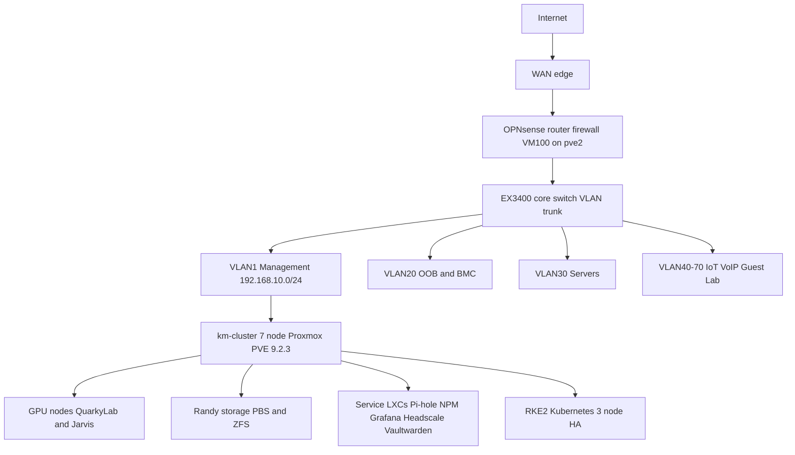

# 🏗️ NetFRAME Architecture Overview

> **Operator:** Kyle Mason (`machismo`) · **Cluster:** km-cluster · 7-node Proxmox VE 9.2.3
> **Location:** Greater Cleveland, OH · **Last Updated:** 2026-07-12

**Tags:** #architecture #overview #reference

> [!NOTE] **Audience:** written top-down for someone seeing NetFRAME for the first time (a new operator or a technical reviewer). It explains *what the system is and why it is built this way*. Deep detail lives in the linked docs and runbooks. Start here, then follow the links.

---

## 🧭 At a glance
NetFRAME is a 7-node Proxmox cluster (**km-cluster**) in a 42U rack, running production-style services behind an OPNsense firewall with full VLAN segmentation. It serves three workloads: **DUNE physics research compute**, **multi-tenant CS-student AI/ML** (SLURM + GPU sharing), and a **self-hosted LLM platform**, alongside the usual self-hosted services (DNS, monitoring, VPN, backup, media). It is operated as if it were a small production environment: config-as-code where it counts, monitoring with alerting, DR-tested backups, and versioned runbooks.

## 🗺️ Topology

## 🎯 Design principles
- **LXC-first, not Docker** — lightweight, Proxmox-native containers for services; Docker only when explicitly required.
- **Config-as-code where it counts** — monitoring stack, OPNsense config backup, and CI/CD live in git; deployment stays deliberate (SSH/systemd/API), not blind auto-deploy.
- **Secrets in Vaultwarden, never hardcoded** — with pre-commit secret scanning.
- **Defense in depth** — VLAN segmentation, out-of-band/BMC isolation on VLAN 20, an internal CA (step-ca), and a SIEM (Wazuh).
- **Observability first** — every node scraped; alerting to Discord including dead-man's-switch watchdogs.
- **Resilience by layer** — DNS HA, Kubernetes control-plane HA, DR-tested backups; single points of failure tracked and retired deliberately. See [[High Availability/High Availability MOC]].
- **Honest about state** — docs are grounded in verified reality, and open gaps are named rather than hidden.

## 🧱 The layers

### Physical
42U rack, dual-UPS A/B power buses, Juniper core switching. See [[Rack Layout]] and [[Power Distribution]].

### Network
OPNsense (VM 100 on pve2) is the router, firewall, and DHCP for the LAN. A Juniper EX3400 is the core switch carrying seven VLANs. Remote access is a self-hosted Headscale tailnet. See [[Networking/Network Overview]] and [[Projects/Headscale]].

| VLAN | ID | Purpose |
|---|---|---|
| Management | 1 | Cluster, corosync, mgmt (192.168.10.0/24) |
| Trusted / iDRAC | 20 | OOB and BMC (isolated) |
| Servers | 30 | NFS, PBS, egress |
| IoT / VoIP / Guest / Lab | 40 / 50 / 60 / 70 | Segmented edge networks |

### Compute
Seven Proxmox nodes: four HP EliteDesk small-form-factor nodes (pve2 dedicated to OPNsense, pve3 to 5 general), plus two Dell R730 GPU nodes (**QuarkyLab**, RTX 8000 48GB, ML/research; **Jarvis**, 2x RTX 6000, LLM inference) and **Randy** (SuperMicro storage/PBS). See [[Compute/Small Node Cluster]], [[Compute/Dell R730 - ML Node]], [[Compute/Dell R730 - General Node]].

### Storage
Randy runs ZFS: `datastore` (RAIDZ2, ~23 TiB usable) and `bulk` (2x 8-wide RAIDZ2 on a DS4246 shelf, ~41 TiB usable), plus Proxmox Backup Server. GPU nodes carry their own ZFS pools for model libraries and scratch. See [[Infrastructure/Storage]].

### Platform services
RKE2 Kubernetes (3-node HA control plane, Cilium, MetalLB, private registry with internal TLS), dual Pi-hole DNS, Nginx Proxy Manager, the Grafana/Prometheus/Loki stack, Vaultwarden, step-ca, Ollama plus an OpenAI-compatible `llm_router`, and Jellyfin. See [[Infrastructure/Proxmox Cluster]] and [[Infrastructure/Services & VMs]].

### Security
Phased VLAN segmentation (BMCs off the flat network onto VLAN 20, services onto VLAN 30, management-plane clamp), Wazuh SIEM, internal CA, rotated and scoped credentials, and pentest remediation. See [[Runbook/Security-VLAN-Segmentation-Phased-2026-07-03]].

### Observability
Prometheus scrapes all nodes; Grafana alerts to Discord across infra and UPS channels, including stale-report and backup-verify dead-man's switches; Scrutiny watches ~50 drives; NUT feeds UPS telemetry. See [[Runbook/Monitoring-Alerting-2026-07-10]].

### Resilience and HA
DNS and the Kubernetes control plane are already HA; WAN failover and an OPNsense CARP pair are in progress; compute, storage, and switch redundancy are the planned next milestones. Full posture and roadmap: [[High Availability/High Availability MOC]].

---

## 🔗 Go deeper
- [[00 - Homelab MOC]] — master index of the whole vault
- [[High Availability/High Availability MOC]] — resilience map and roadmap
- [[Runbook/Production-Readiness-Checklist-2026-07-10]] — prioritized operational punch list
- [[Runbook/RKE2-Phase1-HA-ControlPlane-2026-07-10]] — Kubernetes build
