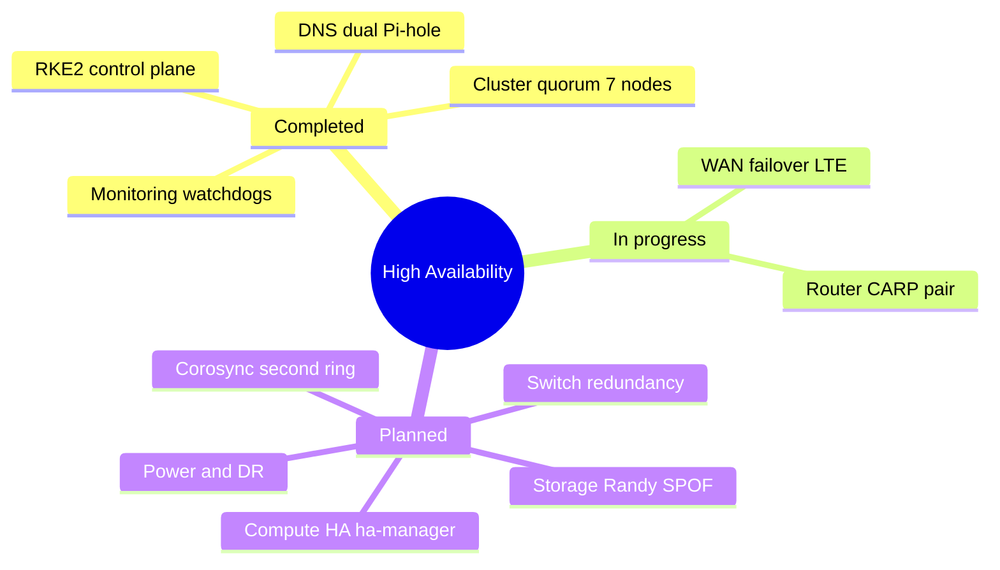

# 🛡️ High Availability Resilience Map

> **Operator:** Kyle Mason (`machismo`) · **Cluster:** km-cluster · 7-node PVE 9.2.3
> **Scope:** single-point-of-failure elimination across every layer · **Last Updated:** 2026-07-12

**Tags:** #ha #reliability #resilience #reference

---

## 🗺️ HA Layer Map

---

## 📊 Coverage at a glance

| Layer | Status | Mechanism | Remaining risk |
|---|---|---|---|
| DNS | ✅ HA | Dual Pi-hole (.177/.178), nebula-sync, DHCP failover all VLANs | none |
| Kubernetes control plane | ✅ HA | 3-node RKE2, etcd quorum, kube-vip VIP (.54) | none |
| Cluster quorum | ✅ | 7 nodes, survives loss of 3 | single corosync ring |
| Monitoring | ✅ | Grafana to Discord alerts plus dead-man's-switch watchdogs | single stack instance |
| WAN uplink | 🟡 building | OPNsense gateway group plus FirstNet 5G failover | in build |
| Router / firewall | 🟡 planned | OPNsense CARP pair (pfSync plus config sync) | single VM on pve2 today |
| Compute (guests) | 🚧 planned | ha-manager plus Ceph or ZFS replication | no auto-recovery on node loss |
| Storage | 🚧 planned | Ceph, or 2nd target plus offsite | Randy is a single node |
| Switching | 🚧 planned | 2nd switch plus Virtual Chassis / LACP | EX3400 single switch |
| Power | 🟡 partial | Dual UPS A/B buses plus NUT graceful shutdown | dual-PSU / circuit split |
| Backup / DR | 🟡 partial | PBS on Randy plus offsite restic to B2 (planned) | PBS single node |

Cluster snapshot (verified 2026-07-12): 7 nodes, quorate (needs 4). `ha-manager` has no resources and storage is all local, so compute-layer auto-recovery is the next foundational milestone.

---

## ✅ Completed
- **DNS HA.** Dual Pi-hole (`.177` on pve1 plus `.178` on pve5 CT 108), nebula-sync mirror, OPNsense DHCP hands out both on all 7 VLAN scopes for automatic client failover. See [[Runbook/DNS-HA-OPNsense-Resilience-2026-07-10]].
- **Kubernetes control plane HA.** 3-node RKE2 (`rke2-cp1/2/3`), etcd quorum, kube-vip API VIP `.54`, Cilium, MetalLB. See [[Runbook/RKE2-Phase1-HA-ControlPlane-2026-07-10]].
- **Cluster quorum.** 7 nodes, quorate, survives loss of up to 3.
- **OPNsense resilience (Tier-A).** Serial console verified, age-encrypted `config.xml` backup repo, cold-restore runbook. See [[Runbook/DNS-HA-OPNsense-Resilience-2026-07-10]].
- **Monitoring watchdogs.** Grafana to Discord alerting including stale-report and backup-verify dead-man's switches. See [[Runbook/Monitoring-Alerting-2026-07-10]].

## 🟡 In progress
- **WAN failover.** FirstNet MR7400 (5G Sub-6) as OPNsense WAN2, gateway-group failover in roughly 5 to 10 seconds. See [[Runbook/WAN-Failover-FirstNet-MR7400-Plan-2026-07-12]].
- **Router HA.** OPNsense CARP pair on a second dedicated box (pfSync state sync plus XMLRPC config sync). Detailed in the same runbook.

## 🚧 Projects (planned, prioritized)
1. **Compute HA (foundation).** `ha-manager` is empty and storage is all local with no replication, so no guest auto-recovers on node failure. Enable via **Ceph** (shared storage) or **ZFS replication plus ha-manager** for critical single-instance guests (monitoring, Headscale, Wazuh, Vaultwarden, primary Pi-hole).
2. **Storage SPOF: Randy.** One box serves PBS backups, RKE2 NFS, the private registry, and bare-metal storage. Fix: Ceph (also solves item 1), a second storage target plus replication, or at minimum finish offsite backup.
3. **Switch redundancy.** EX3400 is a single switch carrying everything including corosync. Add a second switch with Virtual Chassis or LACP and split corosync and uplinks across both.
4. **Corosync second ring.** Only `ring0` today. Add `ring1` on a separate NIC or VLAN so a network hiccup cannot partition the cluster.
5. **Power.** Extend the dual-UPS A/B setup with dual PSUs on separate circuits and NUT automated graceful shutdown. See [[Runbook/NUT-Graceful-Shutdown-Plan-2026-07-22]] and [[Power Distribution]].
6. **Application and DR.** Multi-replica K8s workloads with anti-affinity, Vaultwarden and Headscale redundancy, finished offsite backups, and possibly a second PBS.

## ⚖️ Key decision
Items 1 and 2 are one choice:
- **Ceph** across nodes: shared storage that enables compute HA and removes the Randy storage SPOF at once. Heavy (disks on 3+ nodes, dedicated network, learning curve).
- **ZFS replication plus ha-manager:** lighter, works on the current local disks, small data-loss window, keep Randy and lean on offsite backups.

---

## Status legend
✅ Completed · 🟡 In progress · 🚧 Planned
