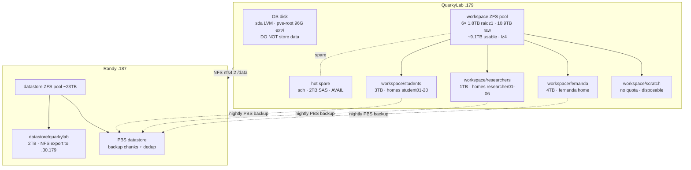

# 💽 QuarkyLab Storage & Backup
**Tags:** #infrastructure #storage #zfs #pbs #backup #quarkylab #ml
**Related:** [[Infrastructure/Storage]] · [[Compute/Dell R730 - ML Node]] · [[Infrastructure/Proxmox Cluster]] · [[Runbook/randy-commissioning-runbook]] · [[00 - Homelab MOC]]

---

## Overview

Storage for **QuarkyLab** (mgmt `.10.179`, ML node / the researcher's DUNE agent + the multi-tenant student SLURM environment) is split into three tiers by purpose: fast local working sets, bulk persistent data on Randy over NFS, and backups to Randy's PBS. Set up during the 2026-07-02 maintenance window.

> [!NOTE] Storage traffic runs on VLAN 30 (since 2026-07-02)
> QuarkyLab and Randy are dual-homed on the `servers` VLAN 30. **NFS `/data` and PBS backup now use the VLAN 30 addresses** - QuarkyLab `192.168.30.179`, Randy `192.168.30.187` - while cluster/management/monitoring stay on VLAN 1 (`.10.x`). See [[Runbook/VLAN30-Migration-Report-2026-07-02]].



> [!NOTE] Backup boundary
> `workspace/scratch` is **disposable and NOT backed up**. Everything a user wants kept must live in their home (`workspace/students|researchers|fernanda`), which is backed up nightly to PBS.

---

## Physical drives & RAID controller

> [!IMPORTANT] The pool lives on JBOD pass-through, not a hardware RAID VD
> QuarkyLab's disks hang off a **Dell PERC H330 Mini** (LSI SAS-3 3008 "Fury" ASIC, ctrl SN `4AM00EM`, FW `25.2.1.0037`) in **RAID-Mode personality with JBOD ON**. Each drive is set to **JBOD** so the OS sees a raw `/dev/sd*` and ZFS owns the redundancy - there is **no** hardware RAID volume. `storcli64` lives at `/usr/local/bin/storcli64` (controller `/c0`). The 8-bay backplane is a Dell **BP13G+** (enclosure `EID 32`, slots 0-7).

### Drive inventory (as of 2026-07-13)

| Slot | Device | Model | Interface | Serial | WWN (by-id) | Role |
|---|---|---|---|---|---|---|
| 32:0 | `sda` | Hitachi HUA723020ALA640 2TB | SATA | MK0171YFHSG5PA | `wwn-0x5000cca223d8c148` | **OS / boot** (LVM: `pve-root` 96G + `pve-data` thin → Wazuh VM 104) |
| 32:1 | `sdb` | Hitachi HUA723020ALA640 2TB | SATA | MK0171YFHRY8YA | `wwn-0x5000cca223d8859d` | `workspace` raidz1 member |
| 32:2 | `sdc` | **HGST HUS724020ALS640 2TB** | **SAS** | **P6JRLE5V** | `wwn-0x5000cca02899d158` | `workspace` raidz1 member (added 2026-07-13) |
| 32:3 | `sdd` | Hitachi HUA723020ALA640 2TB | SATA | MK0131YFG86HLA | `wwn-0x5000cca223c3bb61` | `workspace` raidz1 member |
| 32:4 | `sde` | Hitachi HUA723020ALA640 2TB | SATA | MK0231YGG6N46A | `wwn-0x5000cca224c305d0` | `workspace` raidz1 member |
| 32:5 | `sdf` | Hitachi HUA723020ALA640 2TB | SATA | MK0131YFG87XHA | `wwn-0x5000cca223c3c0b2` | `workspace` raidz1 member |
| 32:6 | `sdg` | Hitachi HUA723020ALA640 2TB | SATA | MK0131YFG87B6A | `wwn-0x5000cca223c3be9a` | `workspace` raidz1 member |
| 32:7 | `sdh` | **HGST HUS724020ALS640 2TB** | **SAS** | **P6HK5U6V** | `wwn-0x5000cca028579e88` | **hot spare** (`AVAIL`, added 2026-07-13) |

The pool is 6 members (`sdb`-`sdg` + the new SAS `sdc`); `sda` is the OS disk and `sdh` is a ZFS hot spare. The old 931 GB Hitachi HUA722010CLA330 (SN `JPW9K0N13BHTVL`) that used to sit in slot 2 was **pulled 2026-07-13** (undersized, never pooled) and replaced by the 2TB SAS drive.

### `workspace` pool geometry

| Property | Value |
|---|---|
| Layout | single vdev, **`raidz1-0`, 6-wide** (single-disk fault tolerance) |
| Raw size | **10.9 TB** (`zpool list`) |
| Usable | ~9.1 TB (5 data disks × 1.82 TB), carved by dataset quotas/reservations below |
| Compression | lz4 · mountpoint `/workspace` |
| ashift | auto (drives are 512 B native) |
| `feature@raidz_expansion` | **active** (used for the 2026-07-13 5→6 widen) |
| Hot spare | 1× 2TB SAS (`sdh`, slot 7) - auto-resilvers on any member failure |

> [!NOTE] Expanded 5→6 wide on 2026-07-13
> The vdev was widened from 5 to 6 disks via **RAIDZ expansion** (`zpool attach workspace raidz1-0 <disk>`). Pre-existing data keeps its **old 5-wide parity ratio** until rewritten, so realised usable growth is a bit under a full disk at first. Full record: [[Runbook/QuarkyLab-Storage-Expansion-2026-07-13]].

### Adding / replacing a drive (PERC H330 + ZFS)

A freshly inserted disk on this PERC appears as **Unconfigured Good** (often with a stale **Foreign** config) and is **not** passed to the OS until set to JBOD:

```bash
storcli64 /c0 show                              # find the new slot (Physical Drives count)
storcli64 /c0 /fall del                         # clear any leftover foreign config
storcli64 /c0 /e32 /sN set jbod                 # N = slot; exposes it as /dev/sdX
for h in /sys/class/scsi_host/host*/scan; do echo "- - -" > "$h"; done   # rescan
# identify a physical drive by blinking its bay LED:
storcli64 /c0 /e32 /sN start locate             # ... stop locate  when done
# then, by stable by-id path:
zpool attach workspace raidz1-0 /dev/disk/by-id/wwn-0x...   # WIDEN the vdev (raidz expansion)
zpool add    workspace spare    /dev/disk/by-id/wwn-0x...   # OR add as a hot spare
```

> [!WARNING] Never `zpool add workspace <disk>` bare
> That stripes a single unprotected disk onto the pool and destroys raidz redundancy. To grow the array use `attach … raidz1-0` (expansion); for a standby use `add … spare`.

> [!NOTE] Slot 7 gotcha - it was a piece of paper
> The first drive put in **slot 7** was undetected by the controller and logged `phy bad for slot 7` (CRIT) - it looked like a dead bay. Root cause was a **piece of paper in the bay** blocking the drive-to-backplane connector. Once removed, slot 7 negotiates a clean 6.0 Gb/s link and passed a sustained-read test with zero I/O errors. The bay is good. (`Other Error Count` on a slot ticks a few counts on each hotplug/reseat - that is link-negotiation, not I/O errors.)

---

## Tier 1 - Local working sets (`workspace` ZFS pool)

Local pool on **6× 1.8 TB HDDs (5× SATA + 1× SAS) in raidz1** (single-disk fault tolerance) plus a **2TB SAS hot spare**, lz4 compression, mounted at `/workspace`. See [Physical drives & RAID controller](#physical-drives--raid-controller) above for the slot/serial map. Drives are 10-13 years old (SATA) - suitable for scratch/working sets, not sole-copy primary storage; everything important is backed up to Randy PBS.

| Dataset | Mountpoint | Quota | Per-user quota | Use |
|---|---|---|---|---|
| `workspace/students` | `/workspace/students` | 3 TB | 100 GB | student01–20 homes |
| `workspace/researchers` | `/workspace/researchers` | 1 TB | 150 GB | researcher01–06 homes |
| `workspace/fernanda` | `/workspace/fernanda` | 4 TB | - | the researcher's home + data |
| `workspace/scratch` | `/workspace/scratch` | 2 TB | 200 GB | disposable per-user scratch (capped so it can't starve the shared pool) |

**Homes live on the pool (model A):** `usermod -d` repointed every student/researcher/fernanda home off the cramped OS disk onto these datasets (2026-07-02). `/home` now holds only admin accounts (kyle, machismo). Student jobs bind `$HOME` + `/workspace/scratch/$USER:/scratch` (see [[Compute/Dell R730 - ML Node]] / job_submit.lua).

The pool also carries two **system datasets** outside the user-home tiers: `workspace/containerd` → `/var/lib/containerd` (the system containerd store, relocated off the OS disk 2026-07-10 - see [[Runbook/QuarkyLab-Containerd-Relocate-to-ZFS-2026-07-10]]) and `workspace/backup` (with a read-only `workspace/backup/randy-fernanda` child).

```bash
zpool status workspace                     # raidz1 health
zfs list -o name,used,avail,quota,mountpoint workspace
zfs userspace workspace/students           # per-user usage vs 100G quota
```

---

## Tier 2 - Bulk persistent (`/data`, NFS from Randy)

Randy exports the ZFS dataset `datastore/quarkylab` (2 TB quota, lz4) to QuarkyLab **only**; QuarkyLab mounts it at `/data`.

| Field | Value |
|---|---|
| Export (on Randy) | `/datastore/quarkylab 192.168.30.179(rw,sync,no_subtree_check,no_root_squash)` (VLAN 30) |
| Mount (on QuarkyLab) | `192.168.30.187:/datastore/quarkylab → /data` (nfs4.2, `_netdev` in fstab, VLAN 30) |
| Holds | `/data/containers/base.sif` (student ML image), `/data/shared` (read-only bind into jobs) |

> [!WARNING] Only `datastore/quarkylab` is exported
> An earlier misconfiguration exported the whole PBS repo to QuarkyLab; that was remediated so `.179` can reach only its own `datastore/quarkylab` dataset. Do not re-export a parent path.

---

## Tier 3 - Backup (Randy PBS)

Randy (`.187`) runs **Proxmox Backup Server** (`:8007`, datastore `datastore` at `/datastore`, ~23 TB). The same ZFS pool does double duty: raw NFS shares (Tier 2) **and** PBS dedup chunk storage.

### Workspace backup (QuarkyLab → PBS)

Script `/usr/local/sbin/pbs-workspace-backup.sh` (700) backs up the three real datasets as separate archives under backup-id `quarkylab-workspace`. `scratch` is excluded by omission; separate archives also avoid ZFS child-dataset mount boundaries.

```bash
# reuses cred /etc/pve/priv/storage/randy-pbs.pw + fingerprint from storage.cfg
export PBS_REPOSITORY="root@pam@192.168.30.187:datastore"   # VLAN 30
proxmox-backup-client backup \
    students.pxar:/workspace/students \
    researchers.pxar:/workspace/researchers \
    fernanda.pxar:/workspace/fernanda \
    --backup-id quarkylab-workspace --backup-type host
proxmox-backup-client prune host/quarkylab-workspace --keep-daily 7 --keep-weekly 4
```

| Job | Where | Schedule | Notes |
|---|---|---|---|
| Workspace backup | QuarkyLab `pbs-workspace-backup.timer` | nightly **01:30** | systemd timer, `Persistent=true` |
| Prune | (in backup script) | each run | keep-daily 7 + keep-weekly 4 |
| Garbage collection | Randy datastore `gc-schedule` | daily **03:00** | reclaims unreferenced chunks (24h+ grace) |
| Verify | Randy `verify-datastore` job | weekly **Sun 04:00** | `ignore-verified`, re-verify >30 days |

> [!NOTE] Dedup is content-addressed
> Re-running the backup with unchanged data uploads **0 bytes** (100% chunk reuse) - only genuinely changed data transfers. Because same-day snapshots are byte-identical, GC after a same-day prune frees ~0 (chunks still referenced by the surviving snapshot); real reclamation happens as older daily/weekly snapshots age out.

Since homes moved off `/home`, the **host-level** `host/quarkylab` backup's `home.pxar` is now near-empty - `host/quarkylab-workspace` is the authoritative home/user-data backup.

### Restore

```bash
export PBS_REPOSITORY="root@pam@192.168.30.187:datastore"
proxmox-backup-client snapshot list host/quarkylab-workspace
# restore one dataset from a snapshot to a target dir
proxmox-backup-client restore host/quarkylab-workspace/<snapshot> students.pxar /restore/students
```

---

## Quick reference

| What | Where |
|---|---|
| Student/researcher/fernanda homes | `/workspace/{students,researchers,fernanda}/…` |
| Disposable scratch (in-job `/scratch`) | `/workspace/scratch/$USER` |
| Student ML container + shared data | `/data/containers/base.sif`, `/data/shared` (Randy NFS) |
| Nightly home backup | PBS `host/quarkylab-workspace` on Randy |
| Backup script / timer | `/usr/local/sbin/pbs-workspace-backup.sh`, `pbs-workspace-backup.timer` |

---

## Change log

| Date | Change |
|---|---|
| 2026-07-13 | Pulled the undersized 931 GB Hitachi from slot 2; added **2× 2TB HGST SAS** (`HUS724020ALS640`). One (`sdc`, SN P6JRLE5V) **expanded `raidz1-0` 5→6 wide** (raidz expansion, raw 9.09→10.9 TB); the other (`sdh`, SN P6HK5U6V, slot 7) added as a **hot spare**. Slot 7's earlier "dead bay" was a piece of paper blocking the connector. See [[Runbook/QuarkyLab-Storage-Expansion-2026-07-13]]. |
| 2026-07-10 | `workspace/containerd` dataset created; system containerd store relocated off the OS disk. See [[Runbook/QuarkyLab-Containerd-Relocate-to-ZFS-2026-07-10]]. |
| 2026-07-02 | Pool + tiers built; homes moved onto ZFS datasets; NFS `/data` + PBS backup moved to VLAN 30. |

---

## Related
- [[Infrastructure/Storage]] - physical JBOD / NetApp DS4246
- [[Compute/Dell R730 - ML Node]] - QuarkyLab node, GPU, student SLURM env
- [[Infrastructure/Proxmox Cluster]] - cluster storage overview
- [[Runbook/QuarkyLab-Storage-Expansion-2026-07-13]] - the 2026-07-13 drive add + raidz expansion
- [[Runbook/randy-commissioning-runbook]] - Randy (PBS/storage) build
