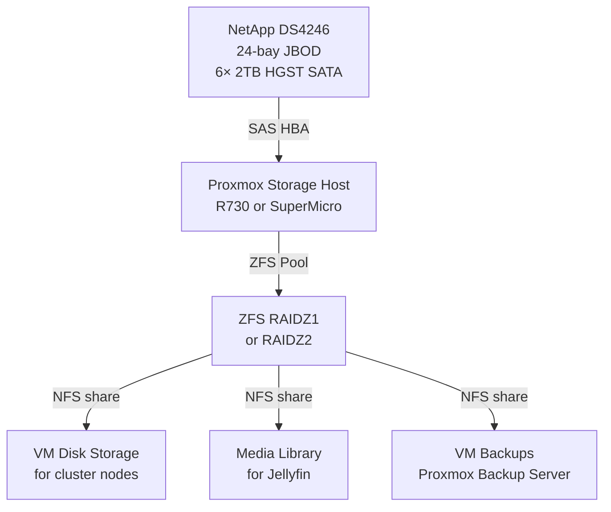

# 💾 Storage
**Tags:** #infrastructure #storage #netapp #jbod  
**Related:** [[Rack Layout]] · [[Infrastructure/Proxmox Cluster]] · [[Infrastructure/Services & VMs]] · [[Infrastructure/QuarkyLab Storage]]

---

## NetApp DS4246 — JBOD Shelf

| Field | Value |
|---|---|
| Model | NetApp DS4246 |
| Form Factor | 4U |
| Rack Position | U8–U12 |
| Bay Count | 24 bays |
| Interface | SAS (dual IOM6 modules) |
| Currently Populated | **16× 4 TB SAS** (9× HGST HUS724040ALS641 + 7× Seagate ST4000NM0063); 8 bays empty |
| Total Raw (current) | **~64 TB** |
| Sector format | **512 B native** — *not* NetApp 520 B, so usable without reformatting |
| Attached to | **Randy** (SuperMicro) via **LSI SAS2308** HBA (PCI `85:00.0`, `mpt2sas`, SCSI host11) |
| Pathing | Dual IOM6 → every disk on **2 paths** (32× `sdX` for 16 disks); **multipath configured 2026-07-08** (exact-wwid whitelist → 16 maps) |
| Enclosure SES id | `0x500a098005bb7186` (vendor NETAPP, product DS424IOM6) |
| Max Capacity | 24× drives |
| Weight (populated) | ~45 lbs — mount before drives above |

> ⚠️ **Inventory corrected 2026-07-07.** This doc previously listed *6× HGST 2 TB SATA / 12 TB* — the shelf has since been repopulated with **16× 4 TB SAS**. Discovered during the Randy sdb replacement; see [[Runbook/Cluster-Health-Fixes-2026-07-07]] §4d.

---

## Current Drive Inventory (2026-07-07)

**16× 4 TB SAS 7.2K, all SMART health OK, grown-defect lists ~0, 512 B sectors.** Blank at qualification (2026-07-07); **now all 16 are in ZFS pool `bulk`** (built 2026-07-08 — see Current State below). These are *used* enterprise drives (mixed power-on hours), so long SMART self-tests were started 2026-07-07 to qualify them before any data use. Bay↔serial mapping not yet done.

| Model | Qty | Capacity | Type | Power-on hrs | Grown defects | SMART |
|---|---|---|---|---|---|---|
| HGST HUS724040ALS641 | 9 | 4 TB | SAS 7.2K | 5× ~6.7 k · 4× ~25 k | 0 | OK |
| Seagate ST4000NM0063 | 7 | 4 TB | SAS 7.2K | used | 0 (one drive = 1) | OK |

**Serials** — HGST: `PCKM0TGX PCKM3Z1X PCKMBNUX PCKMPEJX PCKMREXX` (~6.7 k h), `PCKKXHMX PCKMH28X PCKMKTYX PCKN02AX` (~25 k h). Seagate: `Z1Z862D3 Z1Z85V35 Z1Z861TP Z1Z861NW Z1Z85TD4 Z1Z861CF Z1Z861AQ`.

8 bays remain empty (24-bay shelf, 16 populated).

---

## Current State & Next Steps (as of 2026-07-07)

- **Status:** in ZFS pool **`bulk`** (2× 8-wide RAIDZ2, ~41.3 TiB usable, **ONLINE** — built 2026-07-08). *(Was blank/unallocated at the 2026-07-07 qualification below.)*
- **Long SMART self-tests running** on all 16 (started 07-07 ~10:3x; SAS extended ≈ 7–8 h) to qualify the used drives.
- **Before building any pool:** configure `multipathd` (or deliberately single-path) — the dual IOM6 shelf presents each disk on 2 paths, so ZFS must not be pointed at raw `sdX` or it may grab the same disk twice.
- **Pool BUILT 2026-07-08 → `bulk`, 2× 8-wide RAIDZ2, ~41.3 TiB usable, ONLINE.** All 16 drives passed long self-tests; multipath (exact-wwid whitelist) → 16 maps; datasets `media`/`fernanda`/`archive`/`misc`; `bulk/fernanda` NFS→QuarkyLab .179; weekly scrub + smartd + ZED. `bulk/media` export still pending a media-server target. Full record: [[Runbook/DS4246-Pool-Buildout-Plan-2026-07-07]].

---

## Storage Architecture (Planned — pre-2026-07-07, predates the 16× 4 TB repopulation)

> The mermaid/pool tables below were drafted for the old 6× 2 TB fill. Numbers need reworking for 16× 4 TB (see "Current State & Next Steps" above); kept for the architectural intent.



---

## ZFS Pool Planning

| Config | Raw | Usable | Fault Tolerance |
|---|---|---|---|
| RAIDZ1 (6× 2TB) | 12 TB | ~10 TB | 1 drive failure |
| RAIDZ2 (6× 2TB) | 12 TB | ~8 TB | 2 drive failures |
| Mirror (3× 2-way) | 12 TB | ~6 TB | 1 per mirror group |

**Recommendation:** RAIDZ1 for media (tolerable loss) → RAIDZ2 if drives expand.

```bash
# Create RAIDZ1 pool
zpool create datastore raidz /dev/sda /dev/sdb /dev/sdc /dev/sdd /dev/sde /dev/sdf

# Enable compression
zfs set compression=lz4 datastore

# Create datasets
zfs create datastore/vms
zfs create datastore/media
zfs create datastore/backups

# NFS share
zfs set sharenfs="rw=@10.0.30.0/24,no_root_squash" datastore/vms
```

---

## SAS HBA Notes

- **Actual HBA in use:** LSI **SAS2308** (Fusion-MPT SAS-2, 9207-8e-class) in **Randy**, PCI `85:00.0`, driver `mpt2sas`, SCSI host11 — already presenting drives as JBOD (IT-mode behaviour), good for ZFS.
- DS4246 has **dual IOM6** modules → connect both for redundancy, but then **multipath is required** (each disk appears twice otherwise).
- Run HBA in **IT mode** (passthrough) — not IR mode — for ZFS direct disk access.

---

## Future Expansion

- DS4246 has 18 empty bays — room to grow
- HGST Ultrastar drives are enterprise-grade, compatible with ZFS
- Monitor drive health via `zpool status` and Grafana/SMART dashboard
