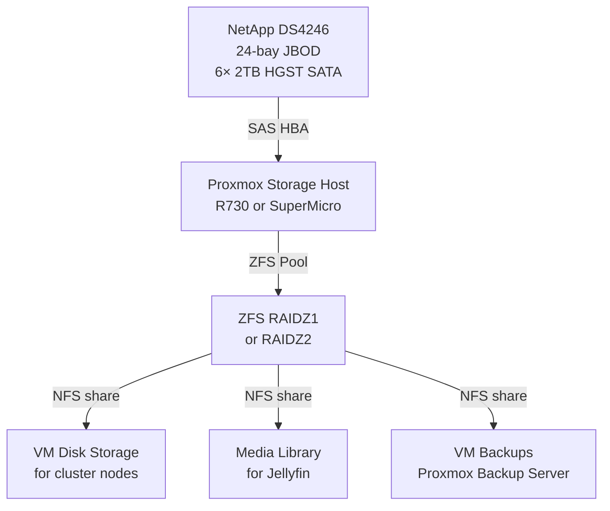

# 💾 Storage
**Tags:** #infrastructure #storage #netapp #jbod  
**Related:** [[Rack Layout]] · [[Infrastructure/Proxmox Cluster]] · [[Infrastructure/Services & VMs]] · [[Infrastructure/QuarkyLab Storage]]

---

## NetApp DS4246 - JBOD Shelf

| Field | Value |
|---|---|
| Model | NetApp DS4246 |
| Form Factor | 4U |
| Rack Position | U8–U12 |
| Bay Count | 24 bays |
| Interface | SAS (dual IOM6 modules) |
| Currently Populated | **22× 4 TB SAS** (9× HGST HUS724040ALS641 + 7× Seagate ST4000NM0063 + **6× Seagate ST4000NM0023 added 2026-07-17**); 2 bays empty |
| Total Raw (current) | **~88 TB** (`bulk` = 80.0 T raw / ~55 TiB usable) |
| Sector format | **512 B native** - *not* NetApp 520 B, so usable without reformatting |
| Attached to | **Randy** (SuperMicro) via **LSI SAS2308** HBA (PCI `85:00.0`, `mpt2sas`, SCSI host11) |
| Pathing | Dual IOM6 → every disk on **2 paths** (44× `sdX` for 22 disks); **multipath configured 2026-07-08, expanded to 22 maps 2026-07-17** (exact-wwid whitelist in `/etc/multipath.conf`) |
| Enclosure SES id | `0x500a098005bb7186` (vendor NETAPP, product DS424IOM6) |
| Max Capacity | 24× drives |
| Weight (populated) | ~45 lbs - mount before drives above |

> ⚠️ **Inventory corrected 2026-07-07.** This doc previously listed *6× HGST 2 TB SATA / 12 TB* - the shelf has since been repopulated with **16× 4 TB SAS**. Discovered during the Randy sdb replacement; see [[Runbook/Cluster-Health-Fixes-2026-07-07]] §4d.

---

## Current Drive Inventory (2026-07-07)

**16× 4 TB SAS 7.2K, all SMART health OK, grown-defect lists ~0, 512 B sectors.** Blank at qualification (2026-07-07); **now all 16 are in ZFS pool `bulk`** (built 2026-07-08 - see Current State below). These are *used* enterprise drives (mixed power-on hours), so long SMART self-tests were started 2026-07-07 to qualify them before any data use. Bay↔serial mapping not yet done.

| Model | Qty | Capacity | Type | Power-on hrs | Grown defects | SMART |
|---|---|---|---|---|---|---|
| HGST HUS724040ALS641 | 9 | 4 TB | SAS 7.2K | 5× ~6.7 k · 4× ~25 k | 0 | OK |
| Seagate ST4000NM0063 | 7 | 4 TB | SAS 7.2K | used | 0 (one drive = 1) | OK |

**Serials** - HGST: `PCKM0TGX PCKM3Z1X PCKMBNUX PCKMPEJX PCKMREXX` (~6.7 k h), `PCKKXHMX PCKMH28X PCKMKTYX PCKN02AX` (~25 k h). Seagate: `Z1Z862D3 Z1Z85V35 Z1Z861TP Z1Z861NW Z1Z85TD4 Z1Z861CF Z1Z861AQ`.

8 bays remain empty (24-bay shelf, 16 populated).

---

## Passthrough / Multipath Health Check — 2026-07-17 ✅

Verified after the 6-drive expansion — the DS4246 passthrough (LSI SAS2308 IT-mode HBA + dual IOM6) is fully healthy:

| Check | Result |
|---|---|
| Multipath | **22/22 maps with both paths `active ready running`** — every disk dual-pathed across both IOM6 modules |
| Failed / faulty / ghost paths | **None** |
| `zpool status -x bulk` | **"pool is healthy"** — 0 read/write/checksum errors |
| Last scrub | 0 repaired, 0 errors (2026-07-17) |
| HBA | LSI SAS2308 (9207-8e class, PCI `85:00.0`) present, clean |
| SAS kernel events | No `mpt`/SAS resets, aborts, or link errors |

> The only kernel-log noise is `ataN: SATA link down (SStatus 0)` — those are **empty onboard motherboard SATA ports** (nothing plugged in), NOT the shelf. The DS4246 rides the SAS2308, which is silent. Harmless — do not chase it.

**Reusable health-check (run on Randy):**
```bash
# 1. every mpath must show 2 active ready running paths
for m in /dev/mapper/mpath*; do n=$(basename $m); \
  echo "$n: $(multipath -ll $n | grep -c 'active ready running') paths"; done
multipath -ll | grep -iE 'failed|faulty|offline|ghost'   # expect no output
# 2. pool health + errors
zpool status -x bulk        # want: "pool 'bulk' is healthy"
# 3. HBA + SAS kernel events (ignore ataN SATA-link-down = empty onboard ports)
lspci | grep -iE 'SAS2308'
dmesg -T | grep -iE 'mpt|sas.*reset|abort|I/O error' | tail
```

---

## Expansion 2026-07-17 — 3rd vdev (6× 4 TB)

Added **6× Seagate ST4000NM0023 4 TB SAS** (Dell-pulled, near-zero POH: 10–85 h) as a **third vdev, 6-wide RAIDZ2** → `bulk` grew **58.2 T → 80.0 T raw** (~+14.5 TiB usable). Pool now **3 vdevs (8+8+6 wide RAIDZ2)**, ONLINE, 0 errors; post-add scrub clean (32 s).

Procedure (each drive dual-pathed, so multipath first — never `zpool add` raw `sdX`):
1. Drives seated; SCSI rescan surfaced all 6 (5 enumerated first, 6th `Z1Z7DSB7` needed `echo "- - -" > /sys/class/scsi_host/host*/scan`).
2. Added the 6 WWIDs to `blacklist_exceptions` in `/etc/multipath.conf` (backup `.bak-20260717-*`) → `multipathd reconfigure` → 6 new maps `mpathq`–`mpathv`, 2 active paths each.
3. **Wiped stale Dell DDF hardware-RAID signature** off each (`wipefs -a`; ZFS refused until clean — `ddf_raid_member` anchor at offset `0x3a3817d5e00`).
4. `zpool add -n` dry-run, then `zpool add bulk raidz2 /dev/mapper/mpath{q,r,s,t,u,v}`.

| mpath | wwid | serial | model | POH | vdev |
|---|---|---|---|---|---|
| mpathq | …631a206b | Z1Z7DLE4 | Seagate ST4000NM0023 | 85 | 2 |
| mpathr | …631a1a07 | Z1Z7DTP7 | Seagate ST4000NM0023 | 25 | 2 |
| mpaths | …631a1bcb | Z1Z7DTMH | Seagate ST4000NM0023 | 50 | 2 |
| mpatht | …631a1053 | Z1Z7DV0K | Seagate ST4000NM0023 | 20 | 2 |
| mpathu | …631a1a43 | Z1Z7DTNV | Seagate ST4000NM0023 | 77 | 2 |
| mpathv | …631a54fb | Z1Z7DSB7 | Seagate ST4000NM0023 | 10 | 2 |

> ℹ️ **No hot spare** in `bulk` (all 6 used for capacity). 2 shelf bays remain free. New vdev is 6-wide (existing are 8-wide) — width mismatch is cosmetic, redundancy (any 2 per vdev) is uniform. Full session: [[Runbook/DS4246-Pool-Buildout-Plan-2026-07-07]] §Expansion 2026-07-17.

---

## Current State & Next Steps (as of 2026-07-17)

- **Status:** ZFS pool **`bulk`** = **3× RAIDZ2 (8+8+6 wide), 80.0 T raw / ~55 TiB usable, ONLINE**, 0 errors (2× 8-wide built 2026-07-08; 3rd 6-wide vdev added 2026-07-17).
- **Long SMART self-tests running** on all 16 (started 07-07 ~10:3x; SAS extended ≈ 7–8 h) to qualify the used drives.
- **Before building any pool:** configure `multipathd` (or deliberately single-path) - the dual IOM6 shelf presents each disk on 2 paths, so ZFS must not be pointed at raw `sdX` or it may grab the same disk twice.
- **Pool BUILT 2026-07-08 → `bulk`, 2× 8-wide RAIDZ2, ~41.3 TiB usable, ONLINE.** All 16 drives passed long self-tests; multipath (exact-wwid whitelist) → 16 maps; datasets `media`/`fernanda`/`archive`/`misc`; `bulk/fernanda` NFS→QuarkyLab .179; weekly scrub + smartd + ZED. `bulk/media` export still pending a media-server target. Full record: [[Runbook/DS4246-Pool-Buildout-Plan-2026-07-07]].

---

## Storage Architecture (Planned - pre-2026-07-07, predates the 16× 4 TB repopulation)

> The mermaid/pool tables below were drafted for the old 6× 2 TB fill. Numbers need reworking for 16× 4 TB (see "Current State & Next Steps" above); kept for the architectural intent.



---

## ZFS Pool Planning

| Config | Raw | Usable | Fault Tolerance |
|---|---|---|---|
| RAIDZ1 (6× 2TB) | 12 TB | ~10 TB | 1 drive failure |
| RAIDZ2 (6× 2TB) | 12 TB | ~8 TB | 2 drive failures |
| Mirror (3× 2-way) | 12 TB | ~6 TB | 1 per mirror group |

**Recommendation:** RAIDZ1 for media (tolerable loss) → RAIDZ2 if drives expand.

```bash
# Create RAIDZ1 pool
zpool create datastore raidz /dev/sda /dev/sdb /dev/sdc /dev/sdd /dev/sde /dev/sdf

# Enable compression
zfs set compression=lz4 datastore

# Create datasets
zfs create datastore/vms
zfs create datastore/media
zfs create datastore/backups

# NFS share
zfs set sharenfs="rw=@10.0.30.0/24,no_root_squash" datastore/vms
```

---

## SAS HBA Notes

- **Actual HBA in use:** LSI **SAS2308** (Fusion-MPT SAS-2, 9207-8e-class) in **Randy**, PCI `85:00.0`, driver `mpt2sas`, SCSI host11 - already presenting drives as JBOD (IT-mode behaviour), good for ZFS.
- DS4246 has **dual IOM6** modules → connect both for redundancy, but then **multipath is required** (each disk appears twice otherwise).
- Run HBA in **IT mode** (passthrough) - not IR mode - for ZFS direct disk access.

---

## Future Expansion

- DS4246 has **2 empty bays** (22/24 populated as of 2026-07-17) - near full
- To add drives: allow-list WWID in `/etc/multipath.conf` → `multipathd reconfigure` → `wipefs -a` any foreign RAID signature → `zpool add bulk raidz2 …`. Never `zpool add` raw `sdX` (dual-pathed shelf); never widen an existing vdev.
- HGST Ultrastar / Seagate Constellation drives are enterprise-grade, compatible with ZFS
- Monitor drive health via `zpool status` and Grafana/SMART dashboard
