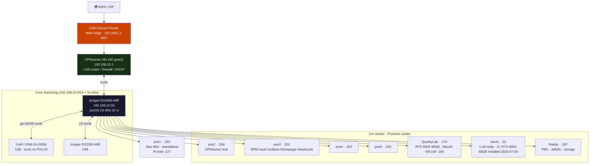

# 🌐 Network Overview
**Tags:** #networking #topology #vlans
**Related:** [[Networking/Juniper EX3400-48P]] · [[Networking/UniFi USW-24-250W]] · [[Networking/Juniper EX2300-48P]] · [[Rack Layout]] · [[00 - Homelab MOC]]

---

> [!NOTE] Current State (2026-06-25)
> **OPNsense (VM 100 on pve2) is the live LAN router/firewall/DHCP** for `192.168.10.0/24` (v25.1.12). The UniFi Dream Router remains **upstream as the WAN edge** (provides the `192.168.1.x` WAN/WiFi side); it is no longer the LAN gateway. **VLANs are live** as of 2026-06-25 (EX3400 ELS).

---

## Physical Topology

---

## VLANs (live - EX3400 ELS, activated 2026-06-25)

| VLAN | ID | Subnet | Purpose |
|---|---|---|---|
| Management | 1 | 192.168.10.0/24 | Default/management (Proxmox, services, switches) |
| Trusted/iDRAC | 20 | 192.168.20.0/24 | iDRAC, IPMI, trusted hosts |
| Servers | 30 | 192.168.30.0/24 | Server workloads |
| IoT | 40 | 192.168.40.0/24 | Smart home / IMUs |
| VoIP | 50 | 192.168.50.0/24 | CP-8841 phones, FreePBX |
| Guest | 60 | 192.168.60.0/24 | Isolated guest WiFi |
| Lab | 70 | 192.168.70.0/24 | Experimental / CCNA lab; sandbox node |

> KEY (EX3400 ELS): `native-vlan-id` goes at **interface level**, NOT under `unit 0 family ethernet-switching`. EX3400 ge-0/0/46 is the trunk to UniFi Port 24, verified end-to-end. See [[Runbook/VLAN-Activation-2026-06-25]].

---

## Current Static IP Assignments (192.168.10.0/24)

| Device | IP | Notes |
|--------|-----|-------|
| OPNsense (LAN gateway) | 192.168.10.1 | VM 100 on pve2, v25.1.12 |
| pve1 (Mac Mini) | 192.168.10.193 | **Standalone** (not in km-cluster); hosts Pi-hole |
| pve2 | 192.168.10.204 | 32GB; hosts OPNsense VM 100, step-ca |
| pve3 | 192.168.10.201 | 48GB; NPM, Vaultwarden, Grafana, Homepage, Headscale, NUT |
| pve4 | 192.168.10.202 | 32GB |
| pve5 | 192.168.10.203 | 32GB |
| QuarkyLab (R730) | 192.168.10.179 | RTX 8000 48GB (installed 2026-07-01); Wazuh VM 104 (.184); Scrutiny collector |
| Jarvis (R730) | 192.168.10.31 | LLM node (2× RTX 6000 48GB installed 2026-07-04, Ollama GPU-backed) |
| Randy (SuperMicro) | 192.168.10.187 | PBS, Jellyfin, storage; Scrutiny hub+collector |
| QuarkyLab iDRAC | 192.168.**20**.20 | svc tag (in ops vault) - **moved to VLAN 20 (Trusted/OOB) 2026-07-03** |
| Jarvis iDRAC | 192.168.**20**.21 | **moved to VLAN 20 (Trusted/OOB) 2026-07-03** |
| Randy IPMI | 192.168.**20**.22 | ADMIN - **moved to VLAN 20 (Trusted/OOB) 2026-07-03** |
| Juniper EX3400 | 192.168.10.50 | JunOS 23.4R2-S7.4 |
| Nginx Proxy Manager | 192.168.10.181 | LXC 101 on pve3 |
| Vaultwarden | 192.168.10.182 | LXC 102 on pve3 |
| Grafana/Prometheus/Loki | 192.168.10.183 | LXC 103 on pve3 |
| Headscale | 192.168.10.186 | LXC 105 on pve3 |
| Homepage | 192.168.10.148 | LXC 106 on pve3 |
| Pi-hole (primary) | 192.168.10.177 | LXC on pve1 (Mac Mini) |
| Pi-hole (secondary) | 192.168.10.178 | CT 108 `netframe-pihole2` on pve5; nebula-sync mirror of .177 (2026-07-10) |
| Ares (laptop, wired) | 192.168.10.100 | enp0s31f6 |

> The RPi 4 backup Pi-hole (formerly `192.168.1.170`) is **decommissioned**.

---

## DNS

| Service | IP | Notes |
|---------|-----|-------|
| Pi-hole (primary) | 192.168.10.177 | LXC on pve1 (Mac Mini); v6 |
| Pi-hole (secondary) | 192.168.10.178 | CT 108 `netframe-pihole2` on pve5; v6; nebula-sync mirror of .177 |
| Tailscale magic DNS | 100.100.100.100 | set `--accept-dns=false` on nodes; Tailscale overwrites `/etc/resolv.conf` |

> **DNS HA (2026-07-10):** OPNsense DHCP hands out **both** `.177` and `.178` (in that order) on **all 7 VLAN scopes** (lan + opt1–opt6), so clients fail over automatically if the primary dies. Resolver chain: client → Pi-hole (.177/.178) → Unbound on `.1` → internet. See [[Runbook/DNS-HA-OPNsense-Resilience-2026-07-10]].

---

## Switching - Quick Reference

| Device | IP | Role |
|--------|-----|------|
| Juniper EX3400-48P | 192.168.10.50 | Core, PoE+, dual PSU, 10G, VLAN trunk |
| UniFi USW-24-250W | - | Access, PoE+; Port 24 trunk to EX3400 ge-0/0/46 |
| Juniper EX2300-48P | - | Secondary / lab isolation |

> Randy 10G: Mellanox ConnectX-3 nic3 → EX3400 xe-0/2/0.
